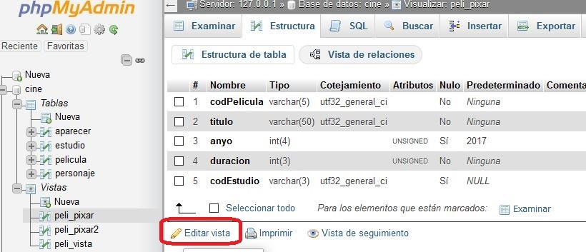

---
title:
    Apuntes
date: 16/06/2021
export_on_save:
    puppeteer: true
    html: true
puppeteer:
    scale: 1
    landscape: false
    format: "A4"
    printBackground: true
    margin:
        top: "1cm"
        right: "1cm"
        bottom: "2.5cm"
        left: "1cm"
    displayHeaderFooter: true
    headerTemplate: "&nbsp;"
    footerTemplate: "
        <span style=\"font-size: 9pt; display: flex;\">
            <span class=\"pageNumber\" style=\"margin-left: 1cm;\"></span>
            /
            <span class=\"totalPages\"></span>
            <span class=\"title\" style=\"margin-left: 1cm;\"></span>
            <span style=\"margin-left: 1cm;\">Xusa García y Juanjo Guarinos</span>
        </span>
                    "
toc:
    depth_from: 1
    depth_to: 5
    ordered: false
---

# Lenguaje SQL
## Contenidos
1. Del diseño lógico al diseño físico
2. Crear Base de Datos
3. Tablas y campos
4. Añadir y editar registros
5. Índices
6. Restricciones
7. Tablas a partir de consultas
8. Vistas


## Del diseño lógico al diseño físico
El **diseño físico** es el proceso de producir la descripción de la implementación de la base de datos en memoria secundaria: estructuras de almacenamiento y métodos de acceso que garanticen un acceso eficiente a los datos.

Para llevar a cabo esta etapa, se debe haber decidido cuál es el SGBD que se va a utilizar, ya que el esquema físico se adapta a él.

En nuestro caso utilizaremos MySQL, y como su sintaxis se adapta en gran medida a SQL ANSI, los comandos que usaremos serán muy similares en el resto de SGBD relacionales.

Cuando llegamos a este punto disponemos de:
* descripción del sistema de información
* el esquema conceptual del modelo entidad-relación
* el esquema del diccionario de datos
* el esquema relacional del modelo relacional

Mientras que en el diseño lógico se especifica qué se guarda, en el diseño físico se especifica cómo se guarda. Para ello, el diseñador debe conocer muy bien toda la funcionalidad del SGBD concreto que se vaya a utilizar y también el sistema informático sobre el que éste va a trabajar.

El diseño físico no es una etapa aislada, ya que algunas decisiones que se tomen durante su desarrollo, por ejemplo para mejorar las prestaciones, pueden provocar una reestructuración del esquema lógico.

El objetivo de esta etapa es producir una descripción de la implementación de la base de datos en memoria secundaria. Esta descripción incluye las estructuras de almacenamiento y los métodos de acceso que se utilizarán para conseguir un acceso eficiente a los datos.

El objetivo por tanto es:
* Conocer las **utilidades o herramientas** para la definición de información en un SGBD.
* Conocer las **órdenes SQL** para la definición de datos.
* Elegir **el tipo de dato** más adecuado para cada tipo de información.
* Definir las **estructuras físicas** de almacenamiento e implantar todas las **restricciones** reflejadas en el diseño lógico (clave primaria, clave alternativa, clave ajena…).

En esta unidad didáctica estudiaremos las instrucciones o comandos SQL del lenguaje de definición de datos (LDD) que permiten la creación de nuestra base de datos y que incluirá las tablas con sus campos e índices.

La primera fase del diseño lógico consiste en traducir el esquema lógico global en un esquema que se pueda implementar en el SGBD escogido. Para ello, es necesario conocer toda la funcionalidad que éste ofrece. Por ejemplo, el diseñador deberá saber:
* Si el sistema soporta la definición de claves primarias, claves ajenas y claves alternativas.
* Si el sistema soporta la definición de datos requeridos (es decir, si se pueden definir atributos como no nulos).
* Si el sistema soporta la definición de dominios.
* Si el sistema soporta la definición de reglas de negocio (es decir, restricciones de cardinalidad o de cálculo)
* Cómo se crean las tablas base

SINTAXIS
Utilizaremos:
* palabras en mayúsculas para las reservadas de MySQL
* palabras en minúsculas para los nombres de nuestros elementos (tablas, campos, índices, …)
* corchetes para indicar un contenido opcional

Para poder conectar a la BD de MySQL vamos a utilizar dos herramientas:
* **Por línea de comandos: `mysql.exe`**
* **Mediante la aplicación web (AW) `phpMyAdmin`**

Las instrucciones que vamos a ejecutar funcionan en las dos herramientas, aunque **phpMyAdmin** proporciona mucha más información de forma gráfica.

Una vez instalado [xampp](https://www.apachefriends.org/es/download.html) abriremos el programa **`c:\xampp\xampp-control.exe`**.

Desde esta herramienta pondremos en marcha el servidor MySQL. Además, si vamos a usar **phpMyAdmin** tendremos que arrancar también el servicio web de **Apache**.

Abriremos las dos herramientas a la vez y comprobaremos que al ejecutar las instrucciones en una de ellas, su resultado se puede ver en las dos.


Para poder conectar con `mysql.exe` abriremos una ventana de comandos (CMD) y nos desplazaremos hasta la carpeta donde tenemos la herramienta. Para conectar debemos indicar que conectamos con el usuario root que no tiene contraseña:

```cmd
C:\> cd \xampp\mysql\bin
C:\xampp\mysql\bin> mysql -u root

```
Para conectar con la Aplicación web phpMyAdmin abriremos un navegador e introduciremos la URL:

```cmd
http://localhost/phpmyadmin
```

Para ejecutar instrucciones usaremos la pestaña SQL.


## Crear Base de Datos
Lo primero que debemos hacer es crear una base de datos.
MySQL permite disponer de varias bases de datos en cada instancia que estemos ejecutado. Cuando conectamos a MySQl podemos conocer las bases de datos que hay creadas con el comando:

```sql
SHOW DATABASES;
```
Para crear una base de datos nueva utilizaremos el comando:

```sql
CREATE DATABASE NombreBD;
```

Podemos añadir otros parámetros por si no son los que MySQL tiene por defecto:


```sql
CREATE DATABASE NombreBD
DEFAULT CHARACTER SET utf8
DEFAULT COLLATE utf8_general_ci;
```

En my.ini se puede indicar en una variable el ENGINE por defecto.

```txt
[mysqld]
default-storage-engine = InnoDB
```


Por defecto ya tiene este valor y podemos comprobarlo en phpMyAdmin en la pestaña “Variables”.

Para eliminar una base de datos nueva utilizaremos el comando:

```sql
DROP DATABASE NombreBD;
```

## Tablas y campos
Para crear una tabla en el DF (Diseño Físico) partiremos del esquema relacional, el diccionario de datos y la documentación de restricciones.

Debemos buscar la información de restricciones de algunos campos:

* **Restricciones por valor**
  Se definen en el diccionario de datos. Estas restricciones pueden estar referidas al:
    * Tipo de dato
    * Longitud
    * Dominio de valores
    * Posibilidad de estar vacío (valor nulo) o no
    * Valor único (no repetido)

* **Restricciones de existencia**
Se definen en el esquema lógico y se detallan en el diccionario de datos Un campo que es clave ajena de una tabla en la relación puede ser opcional (tener valores nulos) o no.  

* **Restricciones de cardinalidad**
Se definen en la documentación de restricciones.

Ejemplo: Cardinalidad máxima definida = Un empleado en una empresa pertenece a varios departamentos, pero como máximo a 4.

* **Restricciones por campos calculados**
Se definen en el diccionario de datos El valor de un campo vendrá dado por una fórmula.

Las restricciones por valor y de existencia tendrán efecto en la propia creación de la tabla, pero las restricciones de cardinalidad y por campos calculados serán definidos por **disparadores (triggers)** que comprueben o calculen los datos y así, garanticen su integridad.

El esquema relacional (modelo lógico) consta de un conjunto de relaciones (tablas) y, para cada una de ellas, se tiene:

* El nombre de la relación (que se convierte en el DF en un tabla)
* La lista de atributos entre paréntesis (que se convierten en el DF en campos)
* La clave primaria y las claves ajenas, si las tiene.
* Las reglas de integridad de las claves ajenas (valor obligatorio o no)

En el diccionario de datos se describen los atributos y, para cada uno de ellos, se tiene:

* Su dominio: tipo de datos, longitud y restricciones de dominio.
* Si puede ser vacío (es decir, si admite valores nulos).
* Si debe tener valor único para cada registro
* El valor por defecto (que es opcional).
* Si es calculado, cómo se calcula su valor.
* Si es enumerado, los valores que puede tener (por ejemplo, SI y NO)

Antes de comenzar necesitaremos conocer algunos tipos de datos de MySQL que utilizaremos:

|Tipo de Dato|Valores|
|:------------|:-------|
|**VARCHAR**| Cadena de caracteres|
|**INT**|Número entero|
|**DECIMAL**|Números decimales|
|**DATE**|Fecha|
|**DATETIME o TIMESTAMP**|Fecha y hora|
|**ENUM**|Conjunto de valores|

!!!NOTE **<u>Referencias</u>**<br>[Tipos de datos en MySQL – Documentación oficial](https://dev.mysql.com/doc/refman/8.0/en/data-types.html)

Para crear una tabla utilizaremos el comando sql **CREATE TABLE** reducido:

```sql
CREATE TABLE NombreTabla (
    Campo1,
    Campo2,
    ...
    CampoN
);
```

La sintaxis para definir un “campo” en la instrucción anterior es:


```sql
nombre_col TIPO
[NOT NULL | NULL]
[DEFAULT valor_por_defecto]
[AUTO_INCREMENT]
[[PRIMARY] KEY]
[UNIQUE]
[COMMENT 'string']
```

!!!NOTE **<u>Referencias</u>**<br>[CREATE TABLE en MySQL – Documentación oficial](https://dev.mysql.com/doc/refman/8.0/en/create-table.html)

**Ejercicio 3.1**

```txt
Partiendo del esquema lógico, crea la tabla de proveedores de nuestra comunidad autónoma siguiente:
proveedores ( cod_prov, localidad, nombre,provincia)
El diccionario de datos (sólo con restricciones de valor) es:
```

|CAMPO|TIPO|LONGITUD|CARACTERÍSTICAS|
|:-----|:----|:--------|:---------------|
|**cod_prov**|Cadena|3|Clave Primaria<br>No Nulo|
|**localidad**|Cadena|100|Nulo|
|**nombre**|Cadena|100|No nulo<br>Único<br>Clave Alternativa|
|**provincia**|Enumerado||'Alicante', 'Valencia', 'Castellón'|

**<u>Solución:</u>**

```sql
CREATE TABLE proveedores (
    cod_prov    VARCHAR(3) PRIMARY KEY,
    localidad   VARCHAR(100) DEFAULT NULL,
    nombre      VARCHAR(100) NOT NULL UNIQUE,
    provincia   ENUM('Alicante','Valencia','Castellón')
);
```

**Ejercicio 3.2**

```txt
En XAMPP-MySQL mediante la utilidad mysql.exe ejecuta las instrucciones anteriores.

Entra a phpMyAdmin y comprueba con el asistente visual la estructura de la tabla y crea otra llamada proveedores2 con la misma información con la herramienta gráfica.
Pulsando en la pestaña Insertar, añade registros a la tabla proveedores.

Comprueba con el botón Examinar los datos introducidos. Comprobarás que aparece un botón Editar y otro Borrar que afecta a cada registro.
```

Con el comando DROP TABLE podemos eliminar una tabla:

```sql
DROP TABLE proveedores;
```

Con el comando RENAME TABLE podemos cambiar su nombre:

```sql
RENAME TABLE proveedores TO distribuidores;
```

Comenzaremos por crear una tabla de artículos con los siguientes campos:

```sql
CREATE TABLE articulos (
    codigo VARCHAR(4),
    descripcion VARCHAR(100),
    precio DECIMAL(10,2)
);
```

**<u>Añadir un campo a una tabla existente</u>**
Una vez creada una tabla, es posible que necesitemos añadir, modificar o eliminar algún campo existente. Para ello utilizaremos las siguientes instrucciones SQL.

```sql
ALTER TABLE articulos
ADD COLUMN descuento INT(3) NOT NULL
AFTER precio;
```

**<u>Modificar un campo a una tabla existente</u>**

A continuación mostramos dos formas de cambiar un campo

```sql
ALTER TABLE articulos
MODIFY COLUMN descuento INT(4) NOT NULL;
```

```sql
ALTER TABLE articulos
CHANGE descuento dto INT(4) NOT NULL;
```

Con la segunda forma podemos cambiar también el nombre del campo de 'descuento' a 'dto' sin perder los valores existentes.

**<u>Eliminar un campo de una tabla existente</u>**

```sql
ALTER TABLE articulos
DROP COLUMN dto;
```

**Ejercicio 3.3**

```txt
En XAMPP-MySQL mediante la utilidad mysql.exe ejecuta las instrucciones anteriores.

Entra a phpMyAdmin y comprueba con el asistente visual la estructura de la tabla articulos.
Inserta registros y comprueba si puedes editar la información.
¿Por qué al Examinar no aparecen los botones Editar y Borrar?
```

## Añadir y editar registros
#### INSERT

**INSERT** inserta nuevas filas en una tabla existente.

El formato **INSERT ... VALUES** inserta filas basándose en los valores especificados explícitamente.
El formato **INSERT ... SELECT** inserta filas seleccionadas de otra tabla o tablas.
La sintaxis para insertar un registro es la siguiente:

```sql
INSERT INTO nombreTabla (col_name1, col_name2, ...)
VALUES (valor_col1, valor_col2, ... );
```

La sintaxis para insertar varios registros es la siguiente:

```sql
INSERT INTO nombreTabla (col_name1, colname2, ...)
VALUES
    (valor1_col1, valor1_col2, ... ),
    (valor2_col1, valor2_col2, ... ),
    ...
    (valorn_col1, valorn_col2, ... );
```

La sintaxis para consultar los registros de una tabla es:

```sql
SELECT col_name1, col_name2, ...
FROM nombreTabla
[WHERE condicion];
```

La sintaxis para insertar registros desde una consulta SELECT es la siguiente:

```sql
INSERT INTO nombreTabla2 (col_name1, col_name2, ...)
SELECT col_name1, col_name2, ...]
FROM nombreTabla1
[WHERE condicion];
```

Si hay campos en la tabla que no se especifican en la instrucción INSERT, se le asignará el valor que se haya indicado en su creación por defecto (DEFAULT) y en caso contrario será NULL.

**Ejemplo**

```sql
INSERT INTO articulos (codigo, descripcion, precio) VALUES
    ('0001','TECLADO INALÁMBRICO', 10.45),
    ('0002','RATÓN INALÁMBRICO', 7.95);
```

## UPDATE
**UPDATE** actualiza columnas de filas existentes de una tabla con nuevos valores.

La cláusula **SET** indica las columnas a modificar y los valores que deben tomar.

La cláusula **WHERE**, si se proporciona, especifica qué filas deben ser actualizadas. Si no se especifica, serán actualizadas todas ellas.

La sintaxis para actualizar registros es:

```sql
UPDATE nombreTabla
SET campo = valor
[WHERE condicion];
```

En la cláusula **SET** utilizaremos valor para indicar una cadena, número, fecha, …

**Ejemplo – Actualizar el nombre a una persona**

```sql
UPDATE personas
SET nombre='Juan López'
WHERE dni='21555666';
```

Pero también puede ser una expresión.

**Ejemplo – Aumentar la edad de una persona por su cumpleaños**

```sql
UPDATE personas
SET edad=edad+1
WHERE dni='21555666';
```

**Ejemplo – Aumentar el precio de todos los artículos un 5%**

```sql
UPDATE articulos
SET precio = precio + precio * 5 / 100;
```

## DELETE
**DELETE** elimina las columnas de una tabla que cumplan la condición dada por la cláusula, y devuelve el número de registros borrados. Sin cláusula **WHERE** elimina todos los registros.

La sintaxis para eliminar registros es:

```sql
DELETE FROM nombreTabla
[WHERE condicion];
```

## Índices
Los indices son estructuras que se crean en las Bases de Daros para poder controlar la integridad y realizar búsquedas de manera más eficiente.

Al crear una tabla podemos crear varios índices con las siguientes palabras reservadas:

* **KEY o PRIMARY KEY**: un índice único para el campo de clave primaria.
* **UNIQUE**: un índice único para un campo que sea clave alternativa.
* **INDEX**: un índice con valores repetidos para optimizar búsquedas sobre un campo.


**Ejemplo**

```sql
CREATE TABLE articulos (
    codigo VARCHAR(4) PRIMARY KEY,
    descripcion VARCHAR(100) UNIQUE,
    categoria VARCHAR(20),
    precio DECIMAL(10,2),
    INDEX [nombreIndice] (categoria)
);
```

Como aparece en el ejemplo anterior, **nombreIndice** se puede especificar o no. Si no se hace tomará el nombre del campo.

**<u>Añadir índices</u>**
Si deseáramos crear un índice con valores repetidos cuando la tabla ya existe, utilizaríamos el comando siguiente:

```sql
CREATE INDEX index_name ON nombreTabla (col_name1,…);
```

Si deseáramos crear un índice cuando con valores únicos cuando la tabla ya existe, utilizaríamos el comando siguiente:

```sql
CREATE UNIQUE INDEX index_name ON nombreTabla (col_name1,…);
```

Para añadir una clave primaria a una tabla que no tiene:

```sql
ALTER TABLE nombreTabla
ADD PRIMARY KEY (col_name1,…);
```

**<u>Eliminar índices</u>**

Para eliminar un índice deberemos saber su nombre:

```sql
DROP INDEX index_name ON nombreTabla;
```

Para eliminar el índice de clave primaria:

```sql
ALTER TABLE nombreTabla
DROP PRIMARY KEY;
```

## Restricciones
#### Restricción de campo clave
La necesidad de identificar un registro unívocamente nos obliga a crear una restricción por el campo clave, ya que este no podrá ser nulo ni tener valores duplicados.

De hecho no se pueden editar los datos de una tabla que no tenga clave primaria, aunque sí se pueden insertar registros.

**<u>Crear campo clave al crear la tabla**</u>

```sql
CREATE TABLE articulos (
    codigo VARCHAR(4) PRIMARY KEY,
    descripcion VARCHAR(100) ,
    precio DECIMAL(10,2)
);
```

**<u>Eliminar la clave primaria**</u>

```sql
ALTER TABLE articulos DROP PRIMARY KEY;
```

**<u>Añadir la clave primaria a una tabla existente**</u>

```sql
ALTER TABLE articulos ADD PRIMARY KEY(codigo);
```

**<u>Claves compuestas**</u>**
En ocasiones la clave está compuesta por varios campos. Por ejemplo en una tabla donde se guardan las revisiones de ITV de vehículos la clave está formada por la fecha y la matrícula del vehículo. Lo podríamos indicar de la siguiente forma:

```sql
CREATE TABLE revision_itv (
    matricula VARCHAR(10),
    fecha DATE,
    estado VARCHAR(100),
    PRIMARY KEY (matricula, fecha)
);
```

o bien:

```sql
CREATE TABLE revision_itv (
    matricula VARCHAR(10),
    fecha DATE,
    estado VARCHAR(100)
);

ALTER TABLE revision_itv ADD PRIMARY KEY (matricula, fecha);
```

#### Restricción de campo obligatorio
Cuando un campo no puede tener valores nulos, decimos que es un campo obligatorio.
En nuestro ejemplo indicaremos la descripción como campo obligatorio par que ningún artículo tenga la descripción vacía.

**<u>Crear campo obligatorio al crear la tabla</u>**

```sql
CREATE TABLE articulos (
codigo VARCHAR(4) PRIMARY KEY,
descripcion VARCHAR(100) NOT NULL,
precio DECIMAL(10,2)
);
```

**<u>Eliminar la restricción de campo obligatorio</u>**

```sql
ALTER TABLE articulos CHANGE descripcion VARCHAR(100) NULL;
```

**<u>Añadir la restricción de campo obligatorio en una tabla que ya existe</u>**

```sql
ALTER TABLE articulos CHANGE descripcion descripcion VARCHAR(100) NOT NULL;
```

#### Restricción de campo con valores únicos
Cuando un campo no puede tener valores repetidos, decimos que es un campo único.
Lo que hace realmente la base de datos es crear un índice con valores únicos.

**<u>Crear campo obligatorio al crear la tabla</u>**

```sql
CREATE TABLE articulos (
    codigo VARCHAR(4) PRIMARY KEY,
    descripcion VARCHAR(100) NOT NULL UNIQUE,
    precio DECIMAL(10,2)
);
```

**<u>Eliminar la restricción de campo obligatorio</u>**
```sql
ALTER TABLE articulos DROP INDEX descripcion;
```

**<u>Añadir la restricción de campo obligatorio en una tabla que ya existe</u>**

```sql
ALTER TABLE articulos ADD UNIQUE(descripcion);
```

#### Restricción de campo por clave ajena
Como ya hemos visto en los esquemas lógicos relacionales obtenidos de los esquemas conceptuales, existen claves ajenas o extranjeras que contienen valores de la clave primaria de otra tabla con la que se relacionan.

En un esquema que tiene localidades y provincias, donde indicamos en cada localidad de qué provincia es, podríamos tener las siguientes tablas:

```sql
CREATE TABLE provincias (
        cod_prov INT(2) PRIMARY KEY,
        provincia VARCHAR(40)
);

CREATE TABLE localidades (
    cod_loc INT(5) PRIMARY KEY,
    localidad VARCHAR(100),
    cod_provincia INT(2)
);
```

**<u>Crear clave ajena al crear la tabla</u>**

```sql
CREATE TABLE localidades (
    cod_loc INT(5) PRIMARY KEY,
    localidad VARCHAR(100),
    cod_provincia INT(2),
    FOREIGN KEY (cod_provincia) REFERENCES provincias (cod_prov)
);
```

Cuando creamos una relación, y por lo tanto una clave ajena, se crean dos elementos en la BD.
* Índice: un índice (en nuestro ejemplo INDEX (cod_provincia)) con el nombre del campo para la clave ajena con valores repetidos, ya que puede ser una relación 1 → N y por lo tanto tendrá que repetir valores. En nuestro ejemplo, varias localidades tendrán la misma provincia.
* Relación: se asigna a la relación un nombre por defecto formado por el nombre de la tabla, 'ibfk' y un numero. En el caso anterior será: localidades_ibfk1.


Si queremos darle un nombre nosotros utilizaremos **CONSTRAINT**:

```sql
CREATE TABLE localidades (
    cod_loc INT(5) PRIMARY KEY,
    localidad VARCHAR(100),
    cod_provincia INT(2),
    CONSTRAINT provincias_cod_prov FOREIGN KEY (cod_provincia) REFERENCES provincias (cod_prov)
);
```

De esta forma se utilizará el valor de CONSTRAINT tanto para el índice como para la relación.

**<u>Eliminar la restricción de clave ajena</u>**
Si tenemos el **CONSTRAINT** lo utilizaremos:

```sql
ALTER TABLE localidades DROP FOREIGN KEY provincias_cod_prov;
```

En caso contrario eliminaremos el que crea por defecto:

```sql
ALTER TABLE localidades DROP FOREIGN KEY localidades_ibkf_1;
```

También tendremos que decidir si deseamos eliminar el índice existente o no. En caso de desear eliminarlo deberemos indicarlo con la instrucción correspondiente según hayamos indicado CONSTRAINT o no:

```sql
ALTER TABLE localidades DROP INDEX provincias_cod_prov;
ALTER TABLE localidades DROP INDEX cod_provincia;
```

**<u>Añadir la restricción de clave ajena a una tabla existente</u>**

```sql
ALTER TABLE localidades ADD 
FOREIGN KEY (cod_provincia) REFERENCES provincias (cod_prov);
```

o con CONSTRAINT:

```sql
ALTER TABLE localidades ADD CONSTRAINT provincias_cod_prov
FOREIGN KEY (cod_provincia) REFERENCES provincias (cod_prov);
```

#### Restricción por borrado o actualización de una clave ajena
Una de las acciones más importantes para mantener la integridad en una base de datos es identificar correctamente la acción a realizar cuando eliminamos o actualizamos el valor de la clave ajena de un registro.

En el caso de vaciar el campo **localidades.cod_provincia** podemos hacer varias acciones:

* **RESTRICT**: Es el valor por defecto. El servidor MySQL rechazará la operación de eliminación o actualización para la tabla padre (provincias) si hay un valor de clave externa relacionado en la tabla referenciada (localidades), es decir, no se puede en provincias eliminar un registro o cambiar su clave, si existen localidades de esa provincia.
* **NO ACTION**: Pertenece al SQL estándar. En MySQL es equivalente a RESTRICT. Algunos sistemas de base de datos tienen verificaciones diferidas, y NO ACTION es un cheque diferido. En MySQL, las restricciones de clave externa se verifican inmediatamente, por lo que NO ACCIÓN es lo mismo que RESTRICT.
* **SET NULL**: Si en la tabla padre (provincias) se elimina un registro o se actualiza su clave, si hay algún valor de clave externa relacionado en la tabla referenciada (localidades) se actualizará el valor a NULL.
Si especifica una acción SET NULL, asegúrese de que no ha declarado las columnas en la tabla secundaria como NOT NULL.

* **CASCADE**:
    * Al **borrar**, si en la tabla padre (provincias) se elimina un registro, se eliminarán también todos los registros de la tabla referenciada (localidades) que tenga este valor en su calve ajena.
    * Al **actualizar**, si en la tabla padre (provincias) se actualiza la clave de un registro, se actualizarán también todos los registros de la tabla referenciada (localidades) que tenga este valor en su clave ajena con el nuevo valor.

Para indicar estas acciones añadiremos a la instrucción de FOREIGN KEY ALGUNA de las siguientes cláusulas:
* ON DELETE RESTRICT
* ON DELETE SET NULL
* ON DELETE CASCADE
* ON UPDATE RESTRICT
* ON UPDATE SET NULL
* ON UPDATE CASCADE

Si por ejemplo deseamos que al eliminar una provincia se eliminen todas las localidades dependientes, y que no permita cambiar el identificador de provincias si tiene localidades, la instrucción de creación de esa clave ajena sería:

```sql
ALTER TABLE localidades ADD CONSTRAINT provincias_cod_prov
FOREIGN KEY (cod_provincia) REFERENCES provincias (cod_prov)
ON DELETE CASCADE
ON UPDATE RESTRICT;
```

* **SET DEFAULT**: <u>No disponible para MySQL con el motor de base de datos InnoDB</u>. Si en la tabla padre (provincias) se elimina un registro o se actualiza su clave, si hay algún valor de clave externa relacionado en la tabla referenciada (localidades) se actualizará el valor por defecto de la clave ajena.


#### Otras restricciones y valores por defecto

**<u>Enteros positivos</u>**
Al definir un campo podemos indicar que sólo se aceptarán números positivos con la palabra reservada **UNSIGNED**:

```sql
CREATE TABLE articulos (
    codigo VARCHAR(3) PRIMARY KEY,
    descripcion VARCHAR(100) NOT NULL,
    precio DECIMAL(10,2) UNSIGNED DEFAULT 0
);
```

**<u>Fecha de alta y de modificación</u>**
Cuando deseamos tener en una tabla la fecha de alta y modificación podemos utilizar campos que se creen y actualicen automáticamente.
Con **DEFAULT CURRENT_TIMESTAMP** un campo obtendrá por defecto el valor de la fecha y hora del sistema.

Con **ON UPDATE CURRENT_TIMESTAMP** un campo actualizará el valor con la fecha y hora del sistema cada vez que se actualice el registro.

```sql
CREATE TABLE ejemplo (
    codigo VARCHAR(2) PRIMARY KEY,
    fecha_alta DATETIME DEFAULT CURRENT_TIMESTAMP,
    fecha_modificacion DATETIME ON UPDATE CURRENT_TIMESTAMP
);
```

**<u>Rellenado a ceros</u>**
Cuando deseemos rellenar con ceros a la izquierda un campo codigo para que estén ordenados utilizaremos la palabra reservada **ZEROFILL**.

```sql
CREATE TABLE ejemplo (
    codigo INT(4) ZEROFILL PRIMARY KEY,
    descripcion VARCHAR(50) NOT NULL
);

INSERT INTO ejemplo (codigo, descripcion) VALUES ('1','registro uno');
```

**<u>Clave primaria automática - Autoincremento</u>**
Cuando tenemos una entidad donde almacenamos registros pero en el esquema conceptual del modelo entidad-relación no teníamos una clave primaria, tenemos que añadir un atributo **codigo** para disponer de una clave primaria.

Lo normal es que esta información no se la pidamos al usuario, ya que en el sistema a analizar no aparecía esta información, por lo que se suele dejar que sea el sistema el que genere este codigo automáticamente con la palabra reservada **AUTO_INCREMENT**.

```sql
CREATE TABLE ejemplo (
    codigo INT(4) AUTO_INCREMENT PRIMARY KEY,
    descripcion VARCHAR(50) NOT NULL
);
I
INSERT INTO ejemplo (descripcion) VALUES ('registro uno');
```

En phpMyAdmin, seleccionando la tabla y luego pulsando en la pestaña operaciones, podemos ver y cambiar el valor siguiente de AUTO_INCREMENT.

#### Restricciones avanzadas
**<u>Campos calculados</u>**
Una solución para los campos calculados es no crearlos en las tablas sino en las consultas con funciones de MySQL.

Este tipo de cálculos y funciones los veremos en la siguiente UD4 donde trabajaremos el lenguaje de consultas SQL con las instrucciones SELECT.

De todas formas, para aquellos que deseen ir practicando, puedes consultar las funciones disponibles en:
[https://dev.mysql.com/doc/refman/8.0/en/func-op-summary-ref.html](https://dev.mysql.com/doc/refman/8.0/en/func-op-summary-ref.html).

**<u>Filtro de valores válidos</u>**
En el lenguaje de SQL existe la palabra reservada **CHECK** para indicar la condición que debe cumplir un valor para ser válido.

Por ejemplo: La nota de un alumno debe estar comprendida entre 0 y 10.

```sql
CREATE TABLE notas (
    nia VARCHAR(8),
    asignatura VARCHAR(15),
    nota DECIMAL (6,2),
    CONSTRAINT check_nota CHECK ( (nota>=0) and (nota<=10) )
);
```

Estas condiciones funcionan perfectamente en muchos SGBD, pero en MySQL, aunque no dan error no se tienen en cuenta.

Por lo tanto, si deseamos controlar estas restricciones deberemos hacer uso de **disparadores o triggers**. En la unidad UD5 profundizaremos en los disparadores (triggers en inglés) pero ahora introduciremos su uso.

Para crear un disparador para controlar valores de un campo al insertar usaremos la siguiente sintaxis:

```sql
/* Crear el disparador */
DELIMITER //
CREATE TRIGGER nombretabla_before_insert BEFORE INSERT ON nombretabla
BEGIN
    FOR EACH ROW BEGIN
        IF (condicion error) THEN
            SIGNAL SQLSTATE '45000';
            SET MESSAGE_TEXT = 'nuevo mensaje de error';
        END IF;
    END;
END //
DELIMITER ;
```

El ejemplo de la nota anterior quedaría:

```sql
/* Crear el disparador */
DELIMITER //
CREATE TRIGGER notas_before_insert BEFORE INSERT ON notas
BEGIN
    FOR EACH ROW BEGIN
        IF ( (NEW.nota<0) or (NEW.nota>10) ) THEN
            SIGNAL SQLSTATE '45000';
            SET MESSAGE_TEXT = 'Compruebe el valor del campo nota que debe estar comprendido entre 0 y 10 puntos';
        END IF;
    END;
END //
DELIMITER ;
```

**<u>Transformaciones antes de grabar</u>**
Al igual que en el apartado anterior CHECK nos permite realizar estos cambios.

Por ejemplo, si queremos que un campo de tipo carácter sólo almacene caracteres en mayúsculas, lo haríamos con la función UPPER() dentro de una restricción CHECK.

Por ejemplo: La asignatura de un alumno debe estar en mayúsculas.

```sql
CREATE TABLE notas (
    nia VARCHAR(8),
    asignatura VARCHAR(15),
    nota DECIMAL (6,2),
    CONSTRAINT check_asignatura CHECK (asignatura = UPPER(asignatura) )
);
```

En MySQL, al no disponer de CHECK utilizaremos el disparador **BEFORE INSERT** como en el apartado anterior.

```sql
/* Crear el disparador */
DELIMITER //
CREATE TRIGGER notas_before_insert BEFORE INSERT ON notas
    BEGIN
        FOR EACH ROW BEGIN
            SET NEW.asignatura = UPPER(NEW.asignatura);
        END;
    END //
DELIMITER ;
```

Para eliminar una restricción de TRIGGER disponemos de la instrucción **DROP**.

```sql
DROP TRIGGER notas_before_insert;
```

## Tablas a partir de consultas
Existe la posibilidad de crear tablas a partir de consultas de otras tablas.

La sintaxis es muy sencilla, pues si tenemos una consulta de tipo:

```sql
SELECT campo1, campo2
FROM nombretabla
WHERE condicion;
```

Podríamos obtener una tabla con la siguiente instrucción SQL:

```sql
CREATE TABLE nuevatabla
SELECT campo1, campo2 FROM nombretabla WHERE condicion;
```

Pero eso sí, la crea sin clave primaria, ni restricciones ni índices.

Por ejemplo, si queremos una copia completa de la tabla provincias en provincias2:

```sql
CREATE TABLE provincias2
SELECT * FROM provincias;
```

## Vistas
Una **vista** es una consulta que se presenta como una tabla (virtual) a partir de un conjunto de tablas en una base de datos relacional.

Las vistas tienen la misma estructura que una tabla: filas y columnas. La única diferencia es que sólo se almacena de ellas la definición, no los datos. Los datos que se recuperan mediante una consulta a una vista se presentarán igual que los de una tabla. De hecho, si no se sabe que se está trabajando con una vista, nada hace suponer que es así. Al igual que sucede con una tabla, se pueden insertar, actualizar, borrar y seleccionar datos en una vista. Aunque siempre es posible seleccionar datos de una vista, en algunas condiciones existen restricciones para realizar el resto de las operaciones sobre vistas.

Una vista se especifica a través de una expresión de consulta (una sentencia SELECT) que la calcula y que puede realizarse sobre una o más tablas. Sobre un conjunto de tablas relacionales se puede trabajar con un número cualquiera de vistas.

La mayoría de los SGBD soportan la creación y manipulación de vistas. Las vistas se crean cuando se necesitan hacer varias sentencias para devolver una tabla final.

La sintaxis es muy sencilla, pues si tenemos una consulta de tipo:

```sql
SELECT campo1, campo2
FROM nombretabla
WHERE condicion;
```

Podríamos obtener una tabla con la siguiente instrucción SQL:

```sql
CREATE VIEW nuevaVista AS
SELECT campo1, campo2
FROM nombretabla
[WHERE condicion];
```

Por ejemplo, si queremos una vista de la tabla personas que sean de la provincia = '1':

```sql
CREATE VIEW personas1 AS
SELECT * FROM personas WHERE cod_provincia='1';
```

#### Vistas para aplicar restricciones
A estas consultas podemos añadir restricciones con la cláusula WHERE para filtrar valores válidos simplemente añadiendo **WITH CHECK OPTION**:

```sql
CREATE VIEW nuevatabla AS
SELECT campo1, campo2
FROM nombretabla
WHERE condicion
WITH CHECK OPTION;
```

Por ejemplo si tenemos una tabla denominada notas_data

```sql
CREATE TABLE notas_data (
    nia VARCHAR(8),
    asignatura VARCHAR(15),
    nota DECIMAL (6,2)
);
```

Podríamos crear una vista para utilizarla como tabla con la restricción de valor de nota entre 0 y 10:

```sql
CREATE VIEW notas AS
SELECT nia, asignatura, nota FROM notas_data WHERE (nota >= 0) and (nota <= 10)
WITH CHECK OPTION;
```

De esta forma nos evitamos tener que crear un trigger, ya que esta vista sería actualizable por disponer de los campos de la tabla directamente.

#### Vistas para aplicar transformaciones o mostrar campos calculados
Por ejemplo si tenemos una tabla denominada notas_data

```sql
CREATE TABLE notas (
    nia VARCHAR(8),
    asignatura VARCHAR(15),
    nota1 DECIMAL (6,2),
    nota2 DECIMAL (6,2)
);
```

También podríamos crear una transformación sobre un campo para su correcta visualización en mayúsculas con UPPER o calcular el promedio de dos campos con un decimal:

```sql
CREATE VIEW notas_view AS
SELECT nia, UPPER(asignatura) as asignatura_upper, nota1, nota2, round((nota1+nota2)/2, 1) as promedio FROM notas;
```

Este sistema nos obligaría a editar los datos en la tabla **notas** pero visualizar el resultado con la vista **notas_view**.

#### Vistas con phpMyAdmin
Una vez hemos creado una vista, podremos editarla si lo deseamos. Para ello, si utilizamos phpMyAdmin, pulsaremos sobre la vista, luego en **Estructura** y posteriormente en **Editar vista**:



