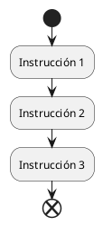
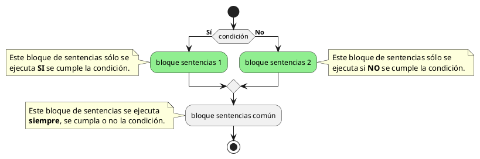
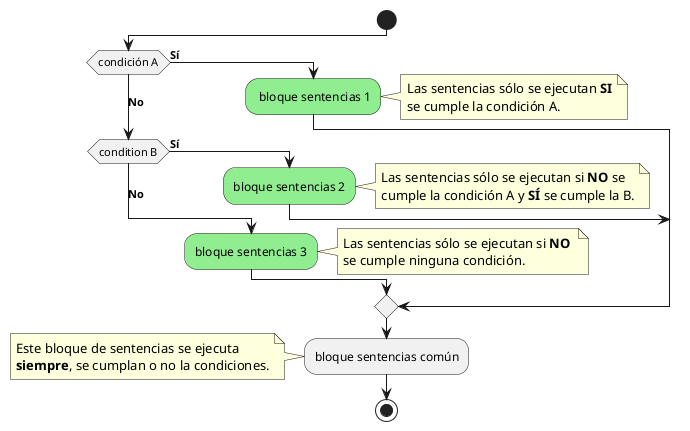
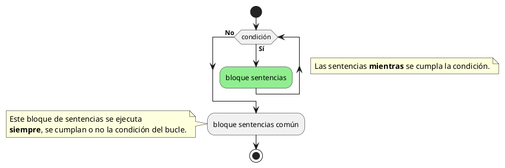

---
title:
    Apuntes
date: 16/06/2021
export_on_save:
    puppeteer: true
    html: true
puppeteer:
    scale: 1
    landscape: false
    format: "A4"
    printBackground: true
    margin:
        top: "1cm"
        right: "1cm"
        bottom: "2.5cm"
        left: "1cm"
    displayHeaderFooter: true
    headerTemplate: "&nbsp;"
    footerTemplate: "
        <span style=\"font-size: 9pt; display: flex;\">
            <span class=\"pageNumber\" style=\"margin-left: 1cm;\"></span>
            /
            <span class=\"totalPages\"></span>
            <span class=\"title\" style=\"margin-left: 1cm;\"></span>
            <span style=\"margin-left: 1cm;\">Xusa García y Juanjo Guarinos</span>
        </span>
                    "
toc:
    depth_from: 1
    depth_to: 5
    ordered: false
---

ÍNDICE

1. Introducción
2. Primeros SCRIPTS
3. Procedimientos y estructuras de control
4. Funciones predefinidas
5. Parámetros de Entrada-Salida
6. Funciones definidas por el usuario
7. Procedimientos y funciones con acceso a datos
8. Disparadores

## Introducción

Analizando el mercado actual de Bases de Datos, el uso de los diferentes productos existentes se ha segmentado.

|Usuarios BD|Bases de datos|
|:------------|:-----------|
|**Grandes Empresas** |La mayoría han apostado por Oracle por su seguridad y soporte.|
|**Pequeñas y medianas Empresas (PYMES)**|Aquí es donde más abierto está el mercado. Entre las más utilizadas están: Oracle Express, SQL Server de Microsoft, MySQL Server y PostgreSQL|
|**Pequeños negocios**|Utilizan software propietario que utiliza SGBD con prestaciones de tipo ofimático como Microsoft Access.|
|**Aplicaciones y páginas web**|La mayoría de los proveedores de internet tienen incluido en sus ofertas MySQL y PostgreSQL, pero los usuarios suelen usar MySQL.|

Aunque los aspectos fundamentales a la forma de utilizar un SGBD son muy parecidos, en este curso nos hemos centrado en **MySQL**.

MySQL es un sistema de gestión de bases de datos SQL (SGBD DBMS) multihilo y multiusuario que tiene más de 10 millones de instalaciones según MySQL AB de Oracle (<https://es.wikipedia.org/wiki/MySQL_AB>).

Las librerías para acceder a bases de datos MySQL están disponibles en los principales lenguajes de programación con APIs específicas de lenguaje. Además,una interfaz ODBC llamada MyODBC permite utilizar lenguajes de programación adicionales que soportan la interfaz ODBC para comunicarse con una base de datos MySQL. El servidor MySQL y las bibliotecas oficiales se implementan principalmente en ANSI C.

MySQL es popular para aplicaciones web y actúa como el componente de base de datos de las plataformas LAMP, MAMP y WAMP (Linux/Mac/Windows-Apache-MySQL-PHP/Perl). Su popularidad como aplicación web está estrechamente ligada a la popularidad de PHP, que a menudo se combina con MySQL. PHP y MySQL son componentes esenciales para ejecutar la popular plataforma de Gestor de Cotnenidos WordPress.

**Cliente / Servidor**
La arquitectura **cliente-servidor** es un modelo de diseño de software en el que las tareas se reparten entre los proveedores de recursos o servicios, llamados servidores, y los demandantes, llamados clientes.

Un cliente realiza peticiones a otro programa, el servidor, quien le da respuesta. Esta idea también se puede aplicar a programas que se ejecutan sobre una sola computadora, aunque es más ventajosa en un sistema operativo multiusuario distribuido a través de una red de computadoras.

Cuando utilizamos un navegado en Internet y accedemos a un servidor mediante una dirección web, utilizamos el protocolo **HTTP** o **HTTPS** para enviar información del cliente al servidor y viceversa.

Tanto cliente como servidor ejecutan código y por lo tanto, procesan las instrucciones de programas y aplicaciones, y para ello se utilizan diferentes lenguajes de programación. A continuación se muestran algunos ejemplos:


Puedes consultar el **Tiobe Index** de los lenguajes de programación más usados en: <https://www.tiobe.com/tiobe-index/>

Puedes consultar la web del **Instituto de Ingeniería Eléctrica y Electrónica** (Institute of Electrical and Electronics Engineers o IEEE), que con más de 425.000 miembros y voluntarios en 160 países, también publica su propia lista de lenguajes de programación más populares (se puede filtrar por Web):
<https://spectrum.ieee.org/static/interactive-the-top-programming-languages-2018>

**Programación en BD**
Los SGBD relacionales usan SQL como lenguaje de DCL, DDL y DML.

* **DCL – Data Control Language** – Lenguaje de Control de Datos
<https://es.wikipedia.org/wiki/Lenguaje_de_control_de_datos>
* **DDL – Data Definition Language** – Lenguaje de Definición de Datos
<https://es.wikipedia.org/wiki/Lenguaje_de_definici%C3%B3n_de_datos>
* **DML – Data Manipulation Language** – Lenguaje de Manipulación de Datos
<https://es.wikipedia.org/wiki/Lenguaje_de_manipulaci%C3%B3n_de_datos>

En las unidades anteriores hemos trabajado tanto el  DDL como el DML.

Las bases de datos relacionales poseen unas extensiones del lenguaje de consultas SQL que les permiten crear bloques de código que se ejecutan como un todo. Hay dos tipos de bloques de código:

* **Scripts**: conjunto de instrucciones que se guardan en un fichero con extensión .sql y que no forman parte de la base de datos. Los scripts se utilizan principalmente para tareas de administración de la base de datos.
* **Procedimientos y funciones almacenadas**: bloques de código que forman parte de una base de datos concreta, como las tablas. Los procedimientos y funciones son compilados después de crealos y pasan a formar parte de la base de datos como otro objeto más. Hay unos procedimientos especiales llamados **triggers** que se ejecutan cuando sucede algún evento sobre las tablas de la base de datos.

Todas las bases de datos relacionales permiten alamacenar código aunque la extemsión del lenguaje tiene una denominación diferente dependiendo del SGBD; en **Oracle se llama PL/SQL**, en **SQL Server Transact-SQL** y en **MySQL Stored Procedure Programming**.

En este tema nos centraremos en MySQL para trabajar con programación a través de **procedimientos**, **funciones** y **tratamiento de eventos**.

!!! Note Referencias
    [MySQL Oficial – Almacenamiento de Programas en MySQL](https://dev.mysql.com/doc/refman/8.0/en/stored-programs-views.html)

Los procedimientos almacenados y funciones son nuevas funcionalidades incluidas desde la versión de MySQL 5.0.
Algunas situaciones en que los procedimientos almacenados pueden ser particularmente útiles:

* Cuando múltiples aplicaciones cliente se escriben en **distintos lenguajes** o funcionan en distintas plataformas, pero necesitan **realizar la misma operación en la base de datos**.
* **Cuando la seguridad es muy importante**. Los bancos, por ejemplo, usan procedimientos almacenados para todas las operaciones comunes. Esto proporciona un entorno seguro y consistente, y los procedimientos pueden asegurar que cada operación se loguea apropiadamente. En tal entorno, las aplicaciones y los usuarios no obtendrían ningún acceso directo a las tablas de la base de datos, sólo pueden ejecutar algunos procedimientos almacenados.

Los procedimientos almacenados pueden mejorar el rendimiento ya que se necesita enviar menos información entre el servidor y el cliente. El inconveniente es que aumenta la carga del servidor de la base de datos ya que la mayoría del trabajo se realiza en la parte del servidor y no en el cliente. Considere esto, si muchas máquinas cliente (como servidores Web) se sirven a sólo uno o pocos servidores de bases de datos.

Los procedimientos almacenados le permiten tener bibliotecas o funciones en el servidor de base de datos. Esta característica es compartida por los lenguajes de programación modernos que permiten este diseño interno, por ejemplo, usando clases. Usando estas características del lenguaje de programación cliente es beneficioso para el programador incluso fuera del entorno de la base de datos.

## Primeros SCRIPTS

### SCRIPTS en MySQL

Comenzaremos por crear nuestro primer script en MySQL con sentencias de **Stored Procedures**.

Utilizaremos **`SELECT`** para mostrar resultados y **`SET`** para guardar valores en variables.

Los scripts de MySQL se puede ejecutar directamente con el programa  **`mysql.exe`**.

<div class="caso_estudio">

**`mysql.exe`** es una shell que conecta con el servidor de MySQL y permite ejecutar instrucciones de SQL. Cuando nos conectamos tenemos que indicar y contraseña si procede.
</div> <!-- fin caso de estudio -->

Para conectarnos como root hacemos:
**`C:\Program Files\MySQL\MySQL Server 8.0\bin> mysql -u root -p`**

!!! Example Ejemplo 1
    **Scripts**
    Crear un script de nombre **`b06ejer01.sql`** en una carpeta de nuestro gusto,por ejemplo **C:\GBD-UD06**. El script calcula la superficie de una pared a partir del ancho y alto de la misma. El ancho y alto se cargan previamente en dos variables.

    El script lo creamos con un editor de texto y su contenido es el siguiente:
    ```sql
    -- En x tenemos el ancho de la pared
    SET @x = 9;
    -- En y tenemos la altura
    SET @y = 15;
    -- La instrucción select calcula y muestra la superficie de la pared conjuntamente con el ancho y la altura.
    SELECT @x AS ancho, @y AS alto, @x * @y AS superficie;
    ```

    El script se puede ejecutar directamente con el programa  **`mysql.exe`**. Una vez que hayamos conectados utilizamos el comando **`source`** para ejecutar el script.

    ```txt
    mysql> source C:/GBD-UD6/b06ejer01.sql;
    Query OK, 0 rows affected (0.00 sec)
    Query OK, 0 rows affected (0.00 sec)
    +-------+------+------------+
    | ancho | alto | superficie |
    +-------+------+------------+
    | 9     | 15   | 135        |
    +-------+------+------------+
    1 row in set (0.00 sec)
    ```

Los nombres de las variables en los scripts tienen que comenzar con el símbolo **@**.
Las instrucciones **SET** y **SELECT** pueden ejecutarse también directamente desde el intérprete de comandos.

### Comentarios

Los comentarios dentro de los SCRIPTS pueden hacerse de la siguiente manera:

```sql
# comentario con almohadilla (solo una linea)
-- Comentario con dos guiones (solo una linea)
/* comentario con barra asterisco (solo una linea) */
/*
  esto es
  un comentario
  multilinea
*/
```

### Variables definidas por el usuario

Para definir una variable de usuario utilizaremos el carácter **@**. Asignaremos valores con el comando **`SET`**:

```sql
SET @num = 9, @cad = 'Hola';
SET @num := 9, @cad := 'Hola';
```

Y para mostrar sus valores la instrucción **`SELECT`**:

```sql
SELECT @num, @cad;
```

Las variables puede usarse en instrucciones **`SELECT`** de recuperación de datos, como:

```sql
SELECT * FROM ciudades WHERE codigo > @num;
```

También podemos calcular y asignar valor en la misma instrucción, almacenando resultados de nuestras **`SELECT`**, pero en este caso sólo funciona el operador **`:=`**. Si no deseamos que se produzca la salida del resultado, sino sólo almacenarlo, podemos usar la cláusula **`INTO`**:

!!! Example Ejemplo 2
    **Scripts**
    Crear un script que asigne a la variable **numreg** la cantidad de ciudades que hay en la tabla **ciudades**.
    ```sql
    -- Asigna el número de ciudades a la variable numreg y muestra el resultado por pantalla.
    SELECT @numreg := COUNT(*) FROM ciudades;

    -- Asigna el número de ciudades a la variable numreg pero NO  muestra el resultado por pantalla.
    SELECT COUNT(*) INTO @numreg FROM ciudades;
    ```

Para consultar todas las variables creadas por el usuario, podemos consultar la tabla **performance_schema.user_variables_by_thread** a partir de la versión 5.7 de MySQL:

```sql
SELECT * FROM performance_schema.user_variables_by_thread;
```

### Variables del sistema

MySQL tiene muchas variables de sistema que pueden consultarse en <https://dev.mysql.com/doc/refman/8.0/en/server-system-variable-reference.html> y que podemos consultar con la instrucción **`SHOW VARIABLES LIKE`**.

```sql
SHOW VARIABLES LIKE '%';
```

Las variables de sistema pueden ser de tipo:

* **GLOBAL**: su valor es para todos los usuarios conectados
* **SESSION**: su valor puede ser diferente para cada usuario

Para mostrar el valor de alguna variable global utilizaremos una doble **@** tal como se muestra en este ejemplo con la variable *max_connections*.

```sql
SELECT @@max_connections;
```

Para asignar un nuevo valor a la variable **GLOBAL** utilizaremos una de las dos opciones siguientes:

```sql
SET GLOBAL max_connections = 50;
SET @@global.max_connections = 50;
```

Por ejemplo la variable *lc_messages* define el idioma en que se muestran los mensajes de error. Podríamos tener el valor *en_US* para tenerlos en inglés o *es_ES* para español.

Para asignar un nuevo valor a la variable de sistema de tipo **SESSION** utilizaremos una de las siguientes cuatro opciones mostradas en el ejemplo con la variable *lc_messages*.

```sql
SET lc_messages = 'es_ES';
SET @@lc_messages='es_ES';
SET SESSION lc_messages = 'es_ES';
SET @@local.lc_messages='es_ES';
```
    
Prueba a ejecutar las siguientes instrucciones después de conectar con **`mysql.exe`** y comprueba el resultado:

```sql
mysql> SET SESSION lc_messages='en_US';
mysql> MENSAJES;
ERROR 1064 (42000): You have an error in your SQL syntax; check
the manual that corresponds to your MySQL server version for the
right syntax to use near 'MENSAJES' at line 1
mysql> SET SESSION lc_messages='es_ES';
mysql> MENSAJES;
ERROR 1064 (42000): Algo está equivocado en su sintax cerca
'MENSAJES' en la linea 1
```

!!! Example Ejemplo 3
    **Scripts**
    Crea un **script** que conecte con la base de datos **world** y guarde en una variable el número de registros de la tabla **city** y en otra el número de registros de la tabla **country**. Ejecutar un **`SELECT`** que muestre la cantidad de registros de las dos tablas.

    El script **`b06ejer02.sql`** tendrá las siguiente instrucciones:
    ```sql
    USE world;
    SELECT @numCity := count(*) FROM city;
    SELECT @numCountry := count(*) FROM country;
    SELECT @numCity AS NREG_City, @numCountry AS NREG_Country;
    ```
    Para ejecutar el script realizamos los siguientes comandos:
    ```cmd 
    C:\> cd "\Program Files\MySQL\MySQL Server 8.0\bin\mysql"
    C:\Program Files\MySQL\MySQL Server 8.0\bin\mysql> mysql -u root -p
    mysql> source C:/GBD-UD6/b06ejer02.sql;
    ```
    
#### Ejecutar scripts

La mayoría de scripts los generamos en UTF8 por lo que deberemos cambiar el conjunto de caracteres de la ventana de comandos del CMD.

```cmd
// Cambiar a juego de caracteres en UTF8
C:\> chcp 65001
// Cambiar a juego de caracteres en ANSI West European Latin
C:\> chcp 1252
```

Para cambiar en timepo real el juego de caracteres en el resultado de los **`SELECT`** en MySQL, podemos utilizar el comando ****`SET NAMES`****.

```sql
// Cambiar a juego de caracteres en UTF8
mysql> SET NAMES 'utf8';
// Cambiar a juego de caracteres en ANSI West European Latin
mysql> SET NAMES 'latin1';
```

El comando **`mysql`** dispone además de muchos parámetros. Usaremos algunos:

|Parámetro|Descripción|
|:-|:-|
|**--silent**| En el modo silencioso no muestra tantos mensajes|
|**--table**| La salida de los SELECT la muestra en formato tabla|
|**--html**| La salida de los SELECT la muestra en formato HTML|

Ejemplo de forma de conexión.

```cmd
//Conectarse como root en modo silencioso
C:\> mysql -u root -p --silent --table
```

## Procedimientos y estructuras de control

### Sintaxis y Estructura

Para poder almacenar un conjunto de instrucciones en la propia base de datos podemos utilizar los procedimientos.

La sintaxis más sencilla es la siguiente:

<div class="caso_estudio" style="font-weight:bold">

```sql
DELIMITER //
CREATE PROCEDURE nombre()
BEGIN
    instrucciones;
END //
DELIMITER ;
```
</div> <!-- fin caso de estudio -->

Antes de comenzar debemos seleccionar la base de datos con la que vamos a trabajar. Por ejemplo para trabajar con la base de datos world ejecutaríamos:

```sql
USE world;
```

Si por ejemplo deseamos un procedimiento que muestre el día y hora sería:

!!! Example Ejemplo 1
    **Procedimientos**
    Realizar un procedimiento que calcule el día y la hora actual y la muestre por pantalla.
    ```sql
    DELIMITER //
    CREATE PROCEDURE diayhora()
    BEGIN
        SELECT NOW();
    END //
    DELIMITER ;
    ```

Para llamar al procedimiento se utiliza el comando **`CALL`**.

!!! Example Ejemplo 2
    **Procedimientos**
    Ejecutar el procedimiento **diayhora** creado en el ejemplo anterior.
    ```sql
    CALL diayhora();
    ```

Los procedimientos se asignan a una base de datos. Esto quiere decir que debemos indicar el **SCHEMA** o BASE DE DATOS al crear o eliminar el procedimiento. Podemos usar previamente la selección de base de datos por defecto con el comando **`USE`** como en el ejemplo anterior o bien indicarla al crear el procedimiento como se hace en los **`SELECT`** de las tablas. Por ejemplo para crear el procedimiento en la base de datos world, independientemente de cual tengamos seleccionada, la cabecera del procedimiento sería: **`CREATE PROCEDURE world.diayhora()`**.

#### DELIMITER

En la declaración del procedimiento hemos usado delimiter pero, ¿por qué es importante el uso del **`DELIMITER`**?.

Ya sabemos que por defecto MySQL usa como delimitador de fin de instrucción el punto y coma (\;) , es decir, cada vez que encuentre punto y como(\;) ejecuta hasta ahí. Como en los procedimientos hay varias líneas de códigos y algunas de ellas terminan con este delimitador se ejecutaría solo hasta ahí, lo que ocasionaría un error, y es por esto que es necesario indicarle a MySQL que utilice otro dlimitador que puede ser cualquiera. Ese es el próposito de la cláusula **`DELIMITER`**.

Para nuestro ejemplo usamos **//** pero se podría usar también **$$** o lo que queramos. Al finalizar la creación del procedimiento o función volvemos a cambiarlo por **;**

<div class="caso_estudio" style="font-weight:bold">

```sql
DELIMITER $$
    ...
    $$
DELIMITER ;
```
</div> <!-- fin caso de estudio -->

#### Bloques de código

Para poder agrupar varias instrucciones en bloques utilizaremos: **`BEGIN ... END`**.
En los procedimientos es necesario porque define el espacio de instrucciones que se almacenan.

Estos bloques de código se usarán más adelante también en estructuras de control como: **`IF .. THEN .. END IF`**

#### Redefinir y Eliminar

Para eliminar un procedimiento utilizaremos la instrucción **`DROP PROCEDURE`**.

<div class="caso_estudio" style="font-weight:bold">

```sql
DROP PROCEDURE nombreProcedimiento;
```

</div> <!-- fin caso de estudio -->

Si queremos redefinir un procedimiento, para evitar que si no existe muestre un error lo haremos utilizando la cláusula **`IF EXISTS`**.

<div class="caso_estudio" style="font-weight:bold">

```sql
DROP PROCEDURE IF EXISTS nombreProcedimiento;
```

</div> <!-- fin caso de estudio -->

### Variables locales del procedimiento

Cuando necesitamos variables que usaremos dentro del procedimiento debemos usar la instrucción **`DECLARE`** como si lo hiciéramos en la instrucción **`CREATE TABLE`**. Las variables sólo serán visibles y accesibles dentro del procedimiento.
Estas variables no comienzan con el caracter especial @, al contrario de lo que sucede en los scripts.

<div class="caso_estudio" style="font-weight:bold">

```sql
DECLARE nombreVariable tipoVariable [opciones];
```

</div> <!-- fin caso de estudio -->

#### Estructuras de control

Las instrucciones de un procedimiento (o función) se ejecutan secuencialmente empezando por la instrucción que está justo después de la palabra reservada **`BEGIN`** y acabando por la que está justo antes de la palabra reservada **`END`**. Esta forma de ejcución de instrucciones se llama **secuencial**. El siguiente diagrama representa un bloque de 3 instrucciones que se ejecutan secuencialmente. El punto negro inicial representa el **`BEGIN`** y el punto con el aspa el **`END`**.



Las estructuras de control permiten modificar el flujo de ejecución de las instrucciones de un programa.

No obstante, hay algunas directiva que nos permiten cambiar el orden secuencial de ejecución de instrucciones. A estas directivas comunmente se les llama estructuras de control. Las estructuras de control se pueden englobar en dos categorías:

* **Estructuras de control condicionales**: en función de una condición se ejecutan un bloque de instrucciones u otro (o ninguno).
* **Estructuras de control de repetición**: permiten que un bloque de instrucciones se ejecuta un cierto o número de veces o mientras se cumpla una condición.

#### Estructuras de control condicionales

**Sentencia IF**
Es la más sencilla de todas. Nos permite ejecutar unas instrucciones u otras según una condición. Hay 3 variantes:

***Variante 1***
Esquema general

<div class="caso_estudio" style="font-weight:bold">

```sql

IF [condicion] THEN
    [sentencia o bloque de sentencias]
END IF;
```

</div> <!-- fin caso de estudio -->


El rombo equivaldría al **`END IF`**.

***Variante 2***
Esquema general

<div class="caso_estudio" style="font-weight:bold">

```sql
IF [condicion] THEN
    [sentencia o bloque de sentencias]
ELSE
    [sentencia o bloque de sentencias]
END IF;
```

</div> <!-- fin caso de estudio -->



***Variante 3***
Esquema general

<div class="caso_estudio" style="font-weight:bold">

```sql
IF [condicion] THEN
    [sentencia o bloque de sentencias]
ELSEIF [condicion] THEN
    [sentencia o bloque de sentencias]
ELSE
    [sentencia o bloque de sentencias]
END IF;
```

</div> <!-- fin caso de estudio -->


    
Puede haber tantas cláusulas **`ELSEIF`** como queramos pero sólo puede haber una cláusula **`IF`** y una **`ELSE`**.

!!! Example Ejemplo 3
    **Procedimientos `IF`**
    En el siguiente ejemplo creamos un procedimiento para mostrar un **color** de forma aleatoria según el valor obtenido con la función **`RAND()`** la cual devuelve un número real entre 0 y 1, es decir, obtenemos un número n que cumple 0 ≤ n < 1.
    ```sql
    -- Eliminar el procedimiento si ya existe
    DROP PROCEDURE IF EXISTS colores;

    -- Crear el procedimiento
    DELIMITER //
    CREATE PROCEDURE colores()
    BEGIN
        DECLARE num DECIMAL(15,2);
        SET num := RAND();
        IF (num < 0.25) THEN
            SELECT 'verde' AS COLOR;
        ELSEIF (num < 0.50) THEN
            SELECT 'amarillo' AS COLOR;
        ELSEIF (num < 0.75) THEN
            SELECT 'naranja' AS COLOR;
        ELSE
            SELECT 'rojo' AS COLOR;
        END IF;
    END //
    
    DELIMITER ;
    
    -- Llamar al procedimiento
    CALL colores();
    ```

***Sentencia CASE***
Cuando tenemos varias opciones como en el ejemplo anterior, podemos utilizar también la estructura **`CASE`**.

<div class="caso_estudio" style="font-weight:bold">

```sql
CASE [variable o expresión]
    WHEN [valor] THEN
        [sentencia o bloque de sentencias]
    [WHEN [valor] THEN
        [sentencia o bloque de sentencias] ]
    [...]
    [ELSE
        [sentencia o bloque de sentencias] ]
END CASE;
```

</div> <!-- fin caso de estudio -->

O bien

<div class="caso_estudio" style="font-weight:bold">

```sql
CASE
    WHEN [condicion] THEN
        [sentencia o bloque de sentencias]
    [WHEN [condicion] THEN
        [sentencia o bloque de sentencias] ]
    [...]
    [ELSE
        [sentencia o bloque de sentencias] ]
END CASE;
```

</div> <!-- fin caso de estudio -->

Los diagramas de flujo de la estructura **`CASE`** son similares a los de la estructura **`IF`** (variante 3).

Si realizamos el mismo ejemplo con **`CASE`** quedaría:

!!! Example Ejemplo 4
    **Procedimientos `CASE`**
    Este ejemplo es igual que el ejemplo anterior pero resuelto utilizando la estructura condicional **`CASE`**.

    ```sql
    /* Eliminar el procedimiento si ya existe */
    DROP PROCEDURE IF EXISTS colorescase;
    /* Crear el procedimiento */
    
    DELIMITER //
    CREATE PROCEDURE colorescase()
    BEGIN
        DECLARE num DECIMAL(15,2);
        SET num := RAND();
        CASE
            WHEN (num < 0.25) THEN
                SELECT 'verde' AS COLOR;
            WHEN (num < 0.50) THEN
                SELECT 'amarillo' AS COLOR;
            WHEN (num < 0.75) THEN
                SELECT 'naranja' AS COLOR;
            ELSE
                SELECT 'rojo' AS COLOR;
        END CASE;
    END //
    DELIMITER ;
    
    /* Llamar al procedimiento */
    CALL colorescase();
    ```

***Sentencia WHILE***
Otra estructura de control es la de bucles, que consisten en realizar de forma repetida un conjunto de instrucciones. Tenemos varias estructuras para hacer bucles como **`REPEAT`** o **`LOOP`**, pero nosotros usaremos **`WHILE`**.

<div class="caso_estudio" style="font-weight:bold">

```sql
WHILE [condicion] DO
    [sentencia o bloque de sentencias]
END WHILE;
```

</div> <!-- fin caso de estudio -->



En el siguiente ejemplo mostramos la suma de los 10 primeros números enteros.

!!! Example Ejemplo 5
    **Procedimientos `WHILE`**
    En el siguiente ejemplo mostramos la suma de los 10 primeros números enteros.

    ```sql
    /* Eliminar el procedimiento si ya existe */
    DROP PROCEDURE IF EXISTS sumadieznumeros;
    
    /* Crear el procedimiento */
    DELIMITER //
    CREATE PROCEDURE sumadieznumeros()
    BEGIN
        DECLARE contador INT;
        DECLARE resultado INT;
        SET resultado := 0;
        SET contador := 1;
        WHILE (contador<=10) DO
            SET resultado := resultado + contador;
            SET contador := contador + 1;
        END WHILE;
        SELECT resultado AS 'SUMADIEZNUMEROS';
    END //
    DELIMITER ;
    
    /* Llamar al procedimiento */
    CALL sumadieznumeros();
    ```

### Parámetros

En muchas ocasiones los procedimientos necesitan recibir valores como parámetros. En MySQL podemos definir estas variables y usarlas dentro del procedimiento. En ejemplo siguiente, si queremos comparar dos cadenas y saber cuál tiene más caracteres, deberemos indicarle al procedimiento qué cadenas comparar.

!!! Example Ejemplo 6
    **Procedimientos parámetros**
    Este es un procedimiento al que se le pasan dos cadenas de caracteres como parámetros y muestra por pantalla que cadena tiene más caracteres.

    ```sql
    /* Eliminar el procedimiento si ya existe */
    DROP PROCEDURE IF EXISTS ud6ejer.comparacadenas;
    
    /* Crear el procedimiento */
    DELIMITER //
    CREATE PROCEDURE ud6ejer.comparacadenas(cad1 VARCHAR(500), cad2 VARCHAR(500))
    BEGIN
        CASE
        WHEN (LENGTH(cad1)>LENGTH(cad2)) THEN
            SELECT 'La PRIMERA cadena es más larga' AS RESULTADO;
        WHEN (LENGTH(cad1)<LENGTH(cad2)) THEN
            SELECT 'La SEGUNDA cadena es más larga' AS RESULTADO;
        ELSE
            SELECT 'La dos cadenas miden lo mismo' AS RESULTADO;
        END CASE;
    END //
    DELIMITER ;
    
    /* Llamar al procedimiento */
    CALL ud6ejer.comparacadenas('Mi primera cadena','Esta debe ser más larga');
    ```

## Funciones predefinidas

Una función es un conjunto de líneas de código que realizan una tarea específica, al  igual  que un procedimiento, pero además puede retornar un valor.
En MySQL existen multitud de funciones predefinidas. Se pueden consultar en la documentación oficial y en otras reconocidas:

!!! Note Referencias

    * [MySQL Oficial – Funciones en MySQL – Web W3SCHOOLS Interactiva](https://www.w3schools.com/sql/sql_ref_mysql.asp)
    * [MySQL Oficial – Funciones en MySQL – Web Oficial en inglés](https://dev.mysql.com/doc/refman/5.7/en/functions.html)
    * [MySQL Oficial – Funciones en MySQL – Web en español](http://ftp.tcrc.edu.tw/MySQL/doc/refman/5.0/es/functions.html)
    * [MySQL Oficial – Funciones en MySQL – Ejemplos]( http://mysql.conclase.net/curso/?cap=011)

Los procedimiento y las funciones son utilizadas para descomponer grandes problemas en tareas simples y para implementar operaciones que son comúnmente utilizadas durante un programa y de esta manera reducir la cantidad de código.

Cuando una función es invocada/llamada, se le pasa el control a la misma, y una vez  que esta finaliza devuelve el control al punto desde el cual fue llamada.

Las funciones pueden tomar parámetros que modifiquen su funcionamiento.

### Funciones matemáticas

Las que más vamos a usar son: **ABS, FLOOR, MOD, POW, SQRT, RAND, ROUND, SIGN**

***Ejemplos de funciones predefinidas***

**Ejemplo 1** - Valor absoluto de un número entero

```sql
 SELECT ABS(-17);
```

Resultado: 17

```sql
# Resultado: 21
SELECT ABS(21);
```

**Ejemplo 2 -  Parte entera de un número decimal**

```sql
SELECT FLOOR(35.789);
```

Resultado: 35

```sql
SELECT FLOOR(-35.789);
```

Resultado: -36

**Ejemplo 3 -  Resto de una división entre dos número enteros**

```sql
SELECT MOD(15, 4);
```

Resultado: 3

**Ejemplo 4 - Potencia de un número y su exponente**

```sql
 SELECT POW(5, 2);
```

 Resultado: 25

**Ejemplo 5 - Raíz cuadrada de un número**

```sql
 SELECT SQRT(64);
```

Resultado: 8

**Ejemplo 6 - Número aleatorio decimal entre 0 y 1**

 ```sql
SELECT RAND();
 ```

Resultado: 0.601966295951946

**Ejemplo 7 - Redondea un número decimal hasta los decimales que se indiquen**

```sql
SELECT ROUND(45.267, 1);
```

Resultado: 45.3

```sql
SELECT ROUND(-45.267, 2);
```

Resultado: -45.27

```sql
SELECT ROUND(45.267);
```

Resultado: 45

```sql
SELECT ROUND(45.75);
```

Resultado: 46

```sql
SELECT ROUND(-45.267);
```

Resultado: -45

```sql
SELECT ROUND(-45.67);
```

Resultado: -46

**Ejemplo 8 - Obtiene el signo del número**

```sql
SELECT SIGN(-45.6);
```

Resultado: -1

```sql
SELECT SIGN(45.6);
```

Resultado: 1

```sql
SELECT SIGN(0);
```

Resultado: 0

## Funciones de cadenas o strings

Las que más vamos a usar son: **CONCAT, UPPER, LOWER, LEFT, RIGHT, SUBSTRING, SUBSTRING_INDEX,INSTR, LENGTH, TRIM, REPEAT, REPLACE, REVERSE, STRCMP**

Ejemplo 1 - Concatenar varias cadenas

```sql
SELECT CONCAT('Juan ','López ','García') AS NOMBRE;
```

 +-------------------+
 | NOMBRE            |
 +-------------------+
 | Juan López García |
 +-------------------+

Ejemplo 2 - Pasar a mayúsculas

```sql
SELECT UPPER('Soy alumno de FP') AS MENSAJE;
```sql

 +------------------+
 | MENSAJE          |
 +------------------+
 | SOY ALUMNO DE FP |
 +------------------+
 
 Ejemplo 2 - Pasar a minúsculas
 ```

```sql
 SELECT LOWER('Soy alumno de FP') AS MENSAJE;
```

 +------------------+
 | MENSAJE          |
 +------------------+
 | soy alumno de fp |
 +------------------+

```sql
Ejemplo 3 - Obtener una parte inicial de la cadena 
SELECT LEFT('Juan López García',4) AS NOMBRE;
```

+--------+
| NOMBRE |
+--------+
| Juan   |
+--------+
/*Obtener una parte final de la cadena */
SELECT RIGHT('Juan López García',6) AS APELLIDO2;
+-----------+
| APELLIDO2 |
+-----------+
| García    |
+-----------+
/* Obtener una parte central de la cadena */
SELECT SUBSTRING('Juan López García',6,5) AS APELLIDO1;
+-----------+
| APELLIDO1 |
+-----------+
| López     |
+-----------+
/* Obtener parte de una cadena utilizando la posición de un delimitador*/
SELECT SUBSTRING_INDEX('www.iesdoctorbalmis.com','.',2) AS DOMINIO;
+---------------------+
| DOMINIO             |
+---------------------+
| <www.iesdoctorbalmis> |
+---------------------+

/* Comprobar si una cadena está en otra */
SELECT INSTR('Juan López García','López') AS POSICION;
+----------+
| POSICION |
+----------+
|
6 |
+----------+
/* Obtener la longitud de una cadena */
SELECT LENGTH('Juan López García') AS LONGITUD;
+----------+
| LONGITUD |
+----------+
|
17 |
+----------+
/* Eliminar de una cadena los espacios al principio y al final*/
SELECT TRIM('
Juan López García
') AS LIMPIO;
+-------------------+
| LIMPIO
|
+-------------------+
| Juan López García |
+-------------------+
/* Crear una cadena a base de repetir otra */
SELECT REPEAT('abc',5);
+-----------------+
| REPEAT('abc',5) |
+-----------------+
| abcabcabcabcabc |
+-----------------+
/* Reemplazar parte de una cadena por otros caracteres */
SELECT REPLACE('SQL Tutorial', 'SQL', 'HTML') AS REEMPLAZADO;
+---------------+
| REEMPLAZADO
|
+---------------+
| HTML Tutorial |
+---------------+
/* Muestra una cadena de forma inversa */
SELECT REVERSE('SQL Tutorial') AS INVERSA;
+--------------+
| INVERSA
|
+--------------+
| lairotuT LQS |
+--------------+
/* Nos dice de dos cadenas cuál va antes en orden alfabético:
-1 → la primera cadena va antes
0 → las dos cadenas son iguales
1 → la segunda cadena va antes
*/
SELECT STRCMP('Mi cadena','Mi cadena') AS COMPARACION;
+-------------+
| COMPARACION |
+-------------+
|
0 |
+-------------+
```

### Funciones de fechas
Las que más vamos a usar son: CURDATE, CURTIME, NOW, ADDDATE, ADDTIME, DATEDIFF, TIMEDIFF, DAY, MONTH, YEAR, HOUR, MINUTE, SECOND, DAYNAME, DAYOFWEEK, MAKETIME, SEC_TO_TIME, TIME_TO_SEC, FROM_DAYS, TO_DAYS, STR_TO_DATE, DATE_FORMAT

Ejemplos de funciones predefinidas

```sql
/* Obtener la FECHA actual */
SELECT CURDATE();
/* Obtener la HORA actual */
SELECT CURTIME();
/* Obtener la FECHA Y HORA actual */
SELECT NOW();
/* Añadir días a un FECHA (DATE O DATETIME) */
SELECT ADDDATE('2018-03-25', 10);
2018-04-06
/* Añadir segundos a un TIME o DATETIME */
SELECT ADDTIME('09:34:21', 45);
09:35:06
SELECT ADDTIME('2018-03-25 09:34:21', 45);
2018-03-25 09:35:06
/* Diferencia de días entre dos FECHAS */
SELECT DATEDIFF('2018-03-25', '2018-02-10');
43
/* Diferencia de segundos entre dos TIME en formato hora
SELECT TIMEDIFF('20:00:00','19:30:30');
00:29:30

/* Obtener el valor del DÍA de una FECHA */
SELECT DAY('2018-03-25');
25
/* Obtener el valor del MES de una FECHA */
SELECT MONTH('2018-03-25');
3
/* Obtener el valor del AÑO de una FECHA */
SELECT YEAR('2018-03-25');
2018
/* Obtener el valor de HORA de un TIME o DATETIME */
SELECT HOUR('2018-03-25 10:36:15');
10
SELECT HOUR('10:36:15');
10
/* Obtener el valor de minutos de un TIME o DATETIME */
SELECT MINUTE('2018-03-25 10:36:15');
36
/* Obtener el valor de segundos de un TIME o DATETIME */
SELECT SECOND('2018-03-25 10:36:15');
15
/* Obtener nombre del día de la semana de una FECHA */
SELECT DAYNAME('2018-03-25 10:36:15');
Sunday
/* Obtener el número de día de la semana comenzando en domingo de una FECHA */
SELECT DAYOFWEEK('2018-03-25 10:36:15');
1
/* Obtener el valor de formato hora a partir de los segundos */
SELECT SEC_TO_TIME(3700);
01:01:40
/* Obtener el valor de formato hora a partir de los segundos */
SELECT TIME_TO_SEC('01:01:40');
3700
/* Obtener valor de formato hora a partir de los horas, minutos y segundos */
SELECT MAKETIME(20, 30, 52);
20:30:52
/* Obtener una fecha a partir del número de días */
SELECT FROM_DAYS(750000);
2053-06-06
/* Obtener en días una fecha */
SELECT TO_DAYS('2018-03-10');
737128
/* Obtener una fecha a partir de una cadena y un formato */
SELECT STR_TO_DATE('12/02/2018','%d/%m/%Y');
2018-02-12
/* Obtener a partir de una fecha indicando el formato */
SELECT DATE_FORMAT('2018-03-15','%Y');
2018
```

!!! Note Referencias

    [MySQL Oficial – Funciones matemáticas](http://mysql.conclase.net/curso/?cap=011a#FUN_FECHA)
    [MySQL Oficial – Funciones en MySQL – Web W3SCHOOLS Interactiva](https://www.w3schools.com/sql/sql_ref_mysql.asp)

### Funciones avanzadas

Las que más vamos a usar son: VERSION, DATABASE, CURRENT_USER, CONVERT, ISNULL, IFNULL, IF, CASE

**Funciones avanzadas para mostrar INFORMACIÓN**
Ejemplos de funciones predefinidas avanzadas

```sql
/* Mostrar la versión de MySQL */
SELECT VERSION();
+-----------------+
| VERSION()
|
+-----------------+
| 10.1.25-MariaDB |
+-----------------+
/* Mostrar la base de datos seleccionada por defecto */
USE ud6ejer;
SELECT DATABASE();
+------------+
| DATABASE() |
+------------+
| ud6ejer
|
+------------+
/* Mostrar el usuario con el que estamos conectados */
SELECT CURRENT_USER();
+----------------+
| CURRENT_USER() |
+----------------+
| root@localhost |
+----------------+
```

**Funciones avanzadas para CONVERSIÓN DE VALORES**
Ejemplos de funciones predefinidas avanzadas

```sql
/* Convertir cadenas a números */
SELECT CONVERT('45.7', DECIMAL(10,2));
+--------------------------------+
| CONVERT('45.7', DECIMAL(10,2)) |
+--------------------------------+
|
45.70 |
+--------------------------------+
/* Convertir números a cadenas*/
SELECT CONVERT(45.7, CHAR);
+---------------------+
| CONVERT(45.7, CHAR) |
+---------------------+
| 45.7
|
+---------------------+
/* Comprobar si un valor es NULL */
SET @num = 10 / 0;
SELECT @num;
+------+
| @num |
+------+
| NULL |
+------+
SELECT ISNULL(@num);
+--------------+
| ISNULL(@num) |
+--------------+
|
1 |
+--------------+
SET @num = 10 / 2;
SELECT ISNULL(@num);
+--------------+
| ISNULL(@num) |
+--------------+
|
0 |
+--------------+
/* Decidir qué valor mostrar si el resultado es NULL */
SET @num = 10 / 0;
SELECT IFNULL(@num, 'Error en división') AS RESULTADO;
+-------------------+
| RESULTADO
|
+-------------------+
| Error en división |
+-------------------+
SET @num = 10 / 2;
SELECT IFNULL(@num, 'Error en división') AS RESULTADO;
+-------------+
| RESULTADO
|
+-------------+
| 5.000000000 |
+-------------+
```

**Funciones avanzadas para PROGRAMACIÓN**
Ejemplos de funciones predefinidas avanzadas

```sql
/* Mostrar valores teniendo en cuenta una condición */
SET @num1 = 25;
SET @num2 = 30;
SELECT IF(@num1>@num2, @num1, @num2) AS MAYOR;
+-------+
| MAYOR |
+-------+
|
30 |
+-------+
/* Mostrar valores teniendo en cuenta varias condiciones */
SET @temperatura = 30;
SELECT CASE
WHEN (@temperatura >= 28) THEN 'Calor'
WHEN (@temperatura >= 10) AND (@temperatura <28) THEN 'Templado'
WHEN (@temperatura >= 0) AND (@temperatura <10) THEN 'Frío'
ELSE 'Bajo cero'
END AS TEMPERATURA;
+-------------+
| TEMPERATURA |
+-------------+
| Calor
|
+-------------+
SET @temperatura = 15;
SELECT CASE
WHEN (@temperatura >= 28) THEN 'Calor'
WHEN (@temperatura >= 10) AND (@temperatura <28) THEN 'Templado'
WHEN (@temperatura >= 0) AND (@temperatura <10) THEN 'Frío'
ELSE 'Bajo cero'
END AS TEMPERATURA;
+-------------+
| TEMPERATURA |
+-------------+
| Templado
|
+-------------+
```

<div class="caso_estudio">

:bulb: **Caso de estudio:**

```sql
SELECT SUBSTRING_INDEX('www.iesdoctorbalmis.com','.',2) AS DOMINIO;
```

```txt
+---------------------+
| DOMINIO             |
+---------------------+
| www.iesdoctorbalmis |
+---------------------+
```

</div> <!-- fin caso de estudio -->

<div class="ejercicio">

### :white_check_mark: Ejercicio

</div> <!-- fin ejercicio -->

## Parámetros de Entrada-Salida

### Parámetros de funciones y procedimientos

Los parámetros son valores o variables que se pueden pasar a los procedimientos o funciones para que los utilicen en su proceso.

<div class="caso_estudio">

Denominaremos **parámetro-valor**  a la constante que pasamos a un procedimiento o función, es decir, un número, una cadena, una fecha, etc.

En cambio, será **parámetro-variable**  cuando lo que le pasamos al procedimiento o función es una variable.

</div> <!-- fin caso de estudio -->

Por ejemplo, cuando a una función como **`ROUND`** le pasamos parámetros, ésta los usa para devolvernos su resultado:

```text
mysql> SELECT ROUND(34.78, 0);
+-----------------+
| ROUND(34.78, 0) |
+-----------------+
| 35              |
+-----------------+
```

En el ejemplo anterior utilizamos un parámetro-valor  que es 34.78 al llamar a la función **`ROUND`**.

En el siguiente ejemplo, realizaremos la misma llamada pero utilizando en uno de los parámetros, un parámetro-variable .

```text
mysql> SET @num := 34.78;
mysql> SELECT ROUND(@num, 0);
+----------------+
| ROUND(@num, 0) |
+----------------+
| 35             |
+----------------+
```

### Tipos de parámetros

Como hemos visto en el último ejemplo de comparación de cadenas del apartado 3, los procedimientos pueden recibir parámetros y ser utilizados en su propio código como variables internas.

Los parámetros pueden ser de varios tipos:

|Tipo|Significado|Descripción|
|:---|:----------|:----------|
|**IN**|De entrada|Se usa el valor de los parámetros, pero estas variables no transforman su valor después del proceso del procedimiento.
|**OUT**|De salida| Se usa la parámetro-variable para asignarle un valor y que lo mantenga una vez terminado el procedimiento.|
|**INOUT**|De entrada y salida|Cumple los dos casos anteriores, se usa el valor del parámetro-variable y al modificar su valor lo mantiene una vez terminado el procedimiento.|

!!!Example Ejemplo 1
    **Párametros valor**
    Procedimiento, de nombre EUROSP, que recibe un número real como parámetro y retorna el valor redondeando a 2 decimales.

    ```sql
    /* Eliminar el procedimiento si ya existe */
    DROP PROCEDURE IF EXISTS eurosp;
    
    /* Crear el procedimiento */
    DELIMITER //
    CREATE PROCEDURE eurosp(importe DECIMAL(15,2))
    BEGIN
        SELECT ROUND(importe, 2) AS EUROS;
    END//
    DELIMITER ;
    
    /* Llamar al procedimiento */
    SELECT 25.34 * 17 / 100;
    CALL eurosp(25.34 * 17 / 100);
    ```

En el ejemplo anterior usamos un parámetro-valor .

En el código de la función observamos que el parámetro importe mantiene su valor. 

!!!Example Ejemplo 2
    **Párametros**
    Llamar al procedimiento anterior con un parámetro-variable.

    ```sql
    /* Llamar al procedimiento */
    SET @precio := 25.34*17/100;
    SELECT @precio;
    CALL ud6ejer.eurosp(@precio);
    ```
Ahora vamos a comprobar qué pasaría si modificamos el valor de un parámetro-valor  dentro del procedimiento.

!!!Example Ejemplo 3
    **Párametros valor**
    Procedimiento que calcula el precio de un artículo al aplicarle un descuento. Recibe como parámetro el precio del artículo y muestra el resultado por pantalla.

    ```sql
    /* Eliminar el procedimiento si ya existe */
    DROP PROCEDURE IF EXISTS preciodto;
    
    /* Crear el procedimiento */
    DELIMITER //
    CREATE PROCEDURE preciodto(precio DECIMAL(15,2), dto DECIMAL(5,2))
    BEGIN
        SET precio := ROUND(precio-(precio*dto/100),2);
        SELECT precio AS EUROS;
    END//
    DELIMITER ;
    
    /* Llamar al procedimiento */
    SET @artprecio := 112.15;
    SET @artdto := 10;
    
    SELECT @artprecio, @artdto;
    CALL preciodto(@artprecio,@artdto);
    SELECT @artprecio, @artdto;
    ```
Aunque usemos una variable al llamar al procedimiento y modifiquemos su valor en el interior del procedimiento, al salir del procedimiento la variable continúa con su valor inicial. Esto es así porque los parámetros por defecto son de **tipo entrada (IN**).

Veamos qué pasa si lo cambiamos al tipo INOUT:

!!! Example Ejemplo 4
    **Párametros variable**
    El mismo ejemplo que el anterior pero pasando el parámetro precio como de **tipo variable (INOUT)**.

    ```sql
    /* Eliminar el procedimiento si ya existe */
    DROP PROCEDURE IF EXISTS preciodto;
    
    /* Crear el procedimiento */
    DELIMITER //
    CREATE PROCEDURE preciodto(INOUT precio DECIMAL(15,2), dto DECIMAL(5,2))
    BEGIN
        SET precio := ROUND(precio-(precio*dto/100),2);
        SELECT precio AS EUROS;
    END//
    DELIMITER ;
    
    /* Llamar al procedimiento */
    SET @artprecio := 112.15;
    SET @artdto := 10;
    SELECT @artprecio, @artdto;
    CALL preciodto(@artprecio,@artdto);
    SELECT @artprecio, @artdto;
    ```
Ahora al llamar al procedimiento y modificar el
valor de la variable en el interior del procedimiento, resulta que la variable tiene el valor que se le ha asignado dentro del procedimiento. En el ejemplo, la variable *@artprecio* ha cambiado su valor.

!!!Example Ejemplo 5
    **Párametros IN**
    Comprueba el valor de la variable *num* después de utilizarse en el procedimiento como parámetro de **tipo IN**.

    ```sql
    /* Eliminar el procedimiento si ya existe */
    DROP PROCEDURE IF EXISTS variableIN;

    /* Crear el procedimiento */
    DELIMITER //
    CREATE PROCEDURE variableIN(IN num INT)
    BEGIN
        SET num = 2 * num;
        SELECT num AS DENTRO_IN;
    END//
    DELIMITER ;
    
    /* Llamar al procedimiento */
    SET @num = 2;
    CALL variableIN(@num);
    SELECT @num AS FUERA_IN;
    ```
    
    La ejecución del código muestra **@num** vale 2 después de la llamada al procedimiento y por lo tanto conserva su valor original aunque se halla modificado en el procedimiento.

!!!Example Ejemplo 6
    **Párametros OUT**

    ```sql
    /* Eliminar el procedimiento si ya existe */
    DROP PROCEDURE IF EXISTS variableOUT;
    
    /* Crear el procedimiento */
    DELIMITER //
    CREATE PROCEDURE variableOUT(OUT num INT)
    BEGIN
        SET num = 2 * num;
        SELECT num AS DENTRO_OUT;
    END//
    DELIMITER ;
    
    /* Llamar al procedimiento */
    SET @num = 3;
    CALL variableOUT(@num);
    SELECT @num AS FUERA_OUT;
    ```
    La ejecución del código muestra que **@num** vale ***NULL*** después de la llamada al procedimiento.
    Los parámetros de sálida pierden su valor, si tenían alguno, antes de ejecutarse la instrucciones del procedimiento, por lo tanto asignarle a **@num** la multiplicación por 2 da como resulta ***NULL*** puesto que **@num** es ***NULL***. 
    Además como el tipo de parámetro es OUT el valor asignado dentro del procedimiento es el valor que tendrá la variable cuando se acabe la ejecución del procedimiento. el procedimiento.

!!!Example Ejemplo 7
    Comprueba el valor de la variable num después de utilizarse en el procedimiento como parámetro de **tipo INOUT**.

    ```sql
    /* Eliminar el procedimiento si ya existe */
    DROP PROCEDURE IF EXISTS ud6er.variableINOUT;

    /* Crear el procedimiento */
    DELIMITER //
    CREATE PROCEDURE variableINOUT(INOUT num INT)
    BEGIN
    SET num = 2 * num;
    SELECT num AS DENTRO_INOUT;
    END//
    DELIMITER ;

    /* Llamar al procedimiento */
    SET @num = 5;
    CALL variableINOUT(@num);
    SELECT @num AS FUERA_INOUT;
    ```

    La ejecución del código muestra que **@num** vale 10 después de la llamada al procedimiento.
    Por lo tanto la modificación de la variable **@num** que se ha producido dentro del procedimiento ha persistido cuando este ha acabado.

## Funciones definidas por el usuario

<div class="caso_estudio">

Las **funciones** se diferencian de los procedimientos en que nos permiten devolver un valor. Todos los parámetros de una función son de entrada y no es necesario indicar IN a los parámetros.

Las **funciones definidas por el usuario** (User Defined Functions – UDF) funcionan como las predefinidas de MySQL pero las creamos con almacenamiento de programas (Stored Programs).

Para crear una UDF usaremos la sintaxis:
<b>

```sql
CREATE FUNCTION nombrefuncion([parámetros])
RETURNS {VARCHAR|INT|DECIMAL|DATE|...}
```
</b>
</div> <!-- fin caso de estudio -->

!!!Example Ejemplo 1
    **Funciones definidas por el usuario**
    Función que recibe una cadena y devuelve la primera letra.

    ```sql
    /* Eliminar la función si ya existe */
    DROP FUNCTION IF EXISTS primeraletra;
    /* Crear la función */
    
    DELIMITER //
    CREATE FUNCTION primeraletra(cadena VARCHAR(100)) RETURNS VARCHAR(1)
    BEGIN
        DECLARE cadresul VARCHAR(1);
        SET cadresul := LEFT(cadena, 1);
        RETURN cadresul;
    END//
    DELIMITER ;
    
    /* Llamar a la función */
    SET @cad = 'Prueba de una función';
    SET @resul = primeraletra(@cad);
    SELECT @resul;
    ```
> :pushpin: En la versión MySQL 8.0, existe una variable global de sistema que puede impedir la creación de funciones. Si recibimos el error:
>
> *This function has none of DETERMINISTIC, NO SQL, or READS SQL DATA in its declaration and binary logging is enabled (you might  want to use the less safe log_bin_trust_function_creators variable)*
>
> deberemos cambiar la configuraració de MySQL Server. Para ello editaremos el archivo:
> **C:\ProgramData\MySQL\MySQL Server 8.0\my.ini**
y  añadiremos bajo la sección [`mysqld`] la línea siguiente:
**log_bin_trust_function_creators= 1**
>
>Después de grabar tendremos que reiniciar el servicio de MySQL 8.0 y podremos comprobar que ya funciona correctamente.

!!!Example Ejemplo 2
    **Funciones definidas por el usuario**
    Función que recibe un número entero y devuelve el siguiente entero.

    ```sql

    /* Eliminar la función si ya existe */
    DROP FUNCTION IF EXISTS signum;

    /* Crear la función */
    DELIMITER //
    CREATE FUNCTION signum(num INT) RETURNS INT
    BEGIN
        DECLARE intresul INT;
        SET intresul := num + 1;
        RETURN intresul;
    END//
    DELIMITER ;
    
    /* Llamar a la función */
    SET @numero = 25;
    SELECT signum(@numero);
    SELECT signum(30);
    ```

Podemos hacer la función anterior con variables de usuario globales en vez de variables de función:

!!!Example Ejemplo 3
    **Funciones definidas por el usuario**
    Función que recibe un número entero y devuelve el siguiente entero.

    ```sql
    /* Eliminar la función si ya existe */
    DROP FUNCTION IF EXISTS signum;

    /* Crear la función */
    DELIMITER //
    CREATE FUNCTION signum(num INT) RETURNS INT
    BEGIN
        SET @intresul := num + 1;
        RETURN @intresul;
    END//
    DELIMITER ;

    /* Llamar a la función */
    SELECT signum(30);
    SELECT @intresul;
    ```
Podemos observar que la variable se ha creado y es global porque mantiene su valor fuera de la función.

!!! Warning Aviso
    Usar variables globales dentro de una función o procedimiento generalmente no se suele utilizar para no dejar valores en memoria y para no interferir en el resultado de diferentes llamadas a la función de forma simultánea.

!!!Example Ejemplo 4
    **Funciones definidas por el usuario**
    Función que no recibe ningún parámetro y devuelve el día siguiente al actual.

    ```sql
    /* Eliminar la función si ya existe */
    DROP FUNCTION IF EXISTS tomorrow;

    /* Crear la función */
    DELIMITER //
    CREATE FUNCTION tomorrow() RETURNS DATE
    BEGIN
        DECLARE fecha DATE;
        SET fecha := ADDDATE(CURDATE(), 1);
        RETURN fecha;
    END//
    DELIMITER ;

    /* Llamar a la función */
    SELECT tomorrow();
    ```

## Procedimientos y funciones con acceso a datos

### Acceso a datos

Los procedimientos y funciones suelen acceder a las bases de datos para procesar información. En muchas ocasiones nos permiten generar campos calculados.

Veamos unos ejemplos con la BD de *World* y algunas funciones predefinidas de control.

!!!Example Ejemplo 1
    **Funciones predefinidas con acceso a datos**
    Obtener los países con un campo calculado adicional denominado **GNPInteranual** en las que indicaremos *Crecimiento* si ha aumentado el **`GNP`** y *Decrecimiento* en otro caso. (**`code`**, **`name`**, **`GNP`**, **`GNPOld`**, **`GNPInteranual`**).

    ```sql
    SELECT code, name, GNP, GNPOld, IF(GNP > GNPOld,'Crecimiento', 'Decrecimiento') AS 'GNPInteranual'
    FROM country
    WHERE (GNP IS NOT NULL) AND (GNPOld IS NOT NULL);
    ```

!!!Example Ejemplo 2
    **Funciones predefinidas con acceso a datos**
    Obtener los países con el nombre del continente al que pertenecen pero traducido (**`code`**, **`name`**, **`continent`**).
    ```sql
    SELECT code, name,
        (CASE continent
            WHEN 'Africa' THEN 'África'
            WHEN 'Antarctica' THEN 'Antártida'
            WHEN 'Asia' THEN 'Asia'
            WHEN 'Europe' THEN 'Europa'
            WHEN 'North America' THEN 'Norteamérica'
            WHEN 'Oceania' THEN 'Oceanía'
            WHEN 'South America' THEN 'Sudamérica'
            ELSE 'n/a'
        END)
    AS 'Continente'
    FROM country;
    ```
También hay casos en que las funciones nos permiten realizar procesos de selección, es decir, usarlas en las condiciones de la cláusula **`WHERE`**.

!!!Example Ejemplo 3
    **Funciones predefinidas con acceso a datos**
    Obtener los países en los que coincide que el campo **`code2`** son las dos primeras letras del campo **`code`**. Mostrar **`code`**, **`name`** y **`code2`**.

    ```sql
    SELECT code, code2, name 
    FROM country 
    WHERE LEFT(code, 2) = code2;
    ```

### Acceso a datos desde funciones definidas por el usuario

Nuestro objetivo principal será desarrollar funciones que procesen datos contenidos en los campos de las tablas y devuelvan valores.

Veamos algunos ejemplos también con la BD *World*.

!!!Example Ejemplo 4
    **Procedimientos y funciones con acceso a datos**
    Realizar una función denominada **CUENTACIUDADES** que reciba como parámetro el código de un país y devuelva el número de ciudades que hay en la BD.

    ```sql
    /* Eliminar la función si ya existe */
    DROP FUNCTION IF EXISTS CUENTACIUDADES;
    
    /* Crear la función */
    DELIMITER //
    CREATE FUNCTION CUENTACIUDADES(pCodePais VARCHAR(3)) RETURNS INT
    BEGIN
        DECLARE intCiudades INT;
        SELECT COUNT(*) INTO intCiudades FROM city WHERE CountryCode = pCodePais;
        RETURN intCiudades;
    END//
    DELIMITER ;
    
    /* Llamar a la función: retorna la cantida de ciudades que hau en Argentiba. */
    SELECT CUENTACIUDADES('ARG');
    +-----------------------+
    | CUENTACIUDADES('ARG') |
    +-----------------------+
    |                    57 |
    +-----------------------+

    /* Llamar a la función: retorna la cantidad de ciudades de cada país */
    SELECT code, name, CUENTACIUDADES(code) AS numciudades FROM country;
    ```
!!!Example Ejemplo 5
    **Procedimientos y funciones con acceso a datos**
    Realizar una función denominada **NOMBRECIUDAD** que reciba como parámetro el ID de una ciudad y devuelva su nombre. La función nunca debe devolver **`NULL`**, pues en este caso devolverá ''.

    ```sql
    /* Eliminar la función si ya existe */
    DROP FUNCTION IF EXISTS NOMBRECIUDAD;
    
    /* Crear la función */
    DELIMITER //
    CREATE FUNCTION NOMBRECIUDAD(pIdCiudad INT) RETURNS VARCHAR(35)
    BEGIN
        DECLARE nCiudad VARCHAR(35);
        SELECT name INTO nCiudad FROM city WHERE ID = pIdCiudad;
        IF nCiudad IS NULL THEN 
            SET nCiudad = '';
        END IF;
        RETURN nCiudad;
    END//
    DELIMITER ;
    
    /* Llamar a la función: retorna Albacete por que 390 es el código de Albacete */
    SELECT NOMBRECIUDAD(390);
    +-------------------+
    | NOMBRECIUDAD(390) |
    +-------------------+
    | Albacete          |
    +-------------------+

    /* Llamar a la función: retorna el código y el nombre de la capital de cada país */
    SELECT code, name, NOMBRECIUDAD(capital) AS NombreCapital FROM country;
    ```

### Control de errores

En muchos casos las funciones que definimos generan errores, como el que se produce al insertar un registro por incumplir restricciones.

Para ver un ejemplo crearemos una función para insertar ciudades en la tabla **city** de la BD *World*.

!!!Example Ejemplo 6
    **Procedimientos y funciones con acceso a datos**
    Realizar una función denominada **INSERTACIUDAD** que reciba como parámetros el (**`Name`**, **`CountryCode`**, **`District`**,  **`Population`**) de una ciudad y la inserte como un nuevo registro en la tabla city de la BD World. El ID no es necesario porque está declarado como **`AUTO_INCREMENT`**. La función devolverá el ID asignado en el **`INSERT`**.

    ```sql
    /* Eliminar la función si ya existe */
    DROP FUNCTION IF EXISTS INSERTACIUDAD;

    /* Crear la función */
    DELIMITER //
    CREATE FUNCTION INSERTACIUDAD(pName VARCHAR(35), pCountryCode VARCHAR(3), pDistrict VARCHAR(20), pPopulation INT) RETURNS INT
    BEGIN
        DECLARE resul INT;
        INSERT INTO city(Name, CountryCode, District, Population) 
        VALUES (pName, pCountryCode, pDistrict, pPopulation);
        SET resul = LAST_INSERT_ID();
        RETURN resul;
    END//
    DELIMITER ;
    
    /* Llamar a la función */
    SELECT INSERTACIUDAD('Elche','ESP','Valencia',227659);
    +------------------------------------------------+
    | INSERTACIUDAD('Elche','ESP','Valencia',227659) |
    +------------------------------------------------+
    |                                           4080 |
    +------------------------------------------------+
    ```

La ejecución del ejemplo anterior inserta correctamente la ciudad de *Elche*. ¿Pero qué pasaría si indicamos un código de país que no existe?

```sql
/* Llamar a la función */
SELECT INSERTACIUDAD('Elche','XXX','Valencia',227659);
```

```text
Error Consulta SQL:
SELECT INSERTACIUDAD('Elche','XXX','Valencia',227659)

MySQL ha dicho: Documentación
#1452 - Cannot add or update a child row: a foreign key constraint fails (`world`.`city`, CONSTRAINT `city_ibfk_1` FOREIGN KEY (`CountryCode`) REFERENCES `country` (`Code`))
```

Como hemos podido observar, cuando se producen errores, perdemos el control del proceso. MySQL permite manejar y controlar los errores mediante el uso de gestor o manejador de errores (**HANDLER**).

<div class="caso_estudio">
<b>

```sql
DECLARE EXIT HANDLER FOR SQLEXCEPTION
BEGIN 
    [instrucciones]
END;
```

</b>
</div> <!-- fin caso de estudio -->

Cuando se produce un error, MySQL nos indica un código de error (*error code*) y un mensaje. Todos estos códigos están en la documentación oficial.
Con un manejador de errores hacemos que en caso de error el programa no aborte si no que se pase el control al manejador y se ejecuten las instrucciones que tiene definidas.

!!! Note Referencias

    [MySQL Oficial – Control de Errores en MySQL – Web Oficial en inglés](https://dev.mysql.com/doc/refman/5.7/en/declare-handlerhtml)
    [MySQL Oficial – Errores en MySQL – Web Oficial en inglés](https:/dev.mysql.com/doc/refman/5.5/en/error-messages-server.html)

***Comprobar los errores***
Cuando se produce un error en una instrucción SQL, obtendremos un error o warning que se almacenará en la BD de control de errores. Este error podemos consultarlo con la instrucción **`SHOW WARNINGS`**.

!!!Example Ejemplo 7
    **Control de errores**
    Eliminar una tabla que no existe y comprobar cual es el error.

    ```sql
    /* Intentamos eliminar una tabla que no existe */
    DROP TABLE mitabla;
    ERROR 1051 (42S02): Tabla 'world.mitabla' desconocida
    
    SHOW WARNINGS;
    +-------+------+-----------------------------------+
    | Level | Code | Message                           |
    +-------+------+-----------------------------------+
    | Error | 1051 | Tabla 'world.mitabla' desconocida |
    +-------+------+-----------------------------------+
    ```
Si deseamos almacenar el código y el mensaje en variables propias usaremos la instrucción **`GET DIAGNOSTICS`**.

!!!Example Ejemplo 8
    **Control de errores**
    Eliminar una tabla que no existe y comprobar cual es el error.

    ```sql
    DROP TABLE mitabla; 
    ERROR 1051 (42S02): Tabla 'world.mitabla' desconocida

    GET DIAGNOSTICS CONDITION 1 @errcode = RETURNED_SQLSTATE, @errmsg = MESSAGE_TEXT;
    
    SELECT @errcode, @errmsg;
    +----------+-----------------------------------+
    | @errcode | @errmsg                           |
    +----------+-----------------------------------+
    | 42S02    | Tabla 'world.mitabla' desconocida |
    +----------+-----------------------------------+
    ```
Vamos a modificar la función **INSERTACIUDAD** para que controle errores de inserción. La función nos devuelve el ID de la ciudad insertada, pero en caso de error deberá devolver el valor -1.

!!!Example Ejemplo 9
    **Control de errores**
    Realizar una función denominada **INSERTACIUDAD** que reciba como parámetros el (**`Name`**, **`CountryCode`**, **`District`**, **`Population`**) de una ciudad y la inserte como un nuevo registro en la tabla **city** de la BD ***World***. El ID no es necesario porque está declarado como **`AUTO_INCREMENT`**. La función devolverá el ID asignado en el **`INSERT`**. En caso de error devolverá el valor -1.

    ```sql
    /* Eliminar la función si ya existe */
    DROP FUNCTION IF EXISTS INSERTACIUDAD;
    
    /* Crear la función */
    DELIMITER //
    CREATE FUNCTION INSERTACIUDAD(pName VARCHAR(35), pCountryCode VARCHAR(3), pDistrict VARCHAR(20), pPopulation INT) RETURNS INT
    BEGIN
        DECLARE resul INT;
        
        DECLARE EXIT HANDLER FOR SQLEXCEPTION 
        BEGIN 
            SET resul = -1; 
            RETURN resul; 
        END;
        
        INSERT INTO city(Name, CountryCode, District, Population) 
        VALUES (pName, pCountryCode, pDistrict, pPopulation);
        SET resul = LAST_INSERT_ID();
        RETURN resul;
    END//
    DELIMITER ;
    
    /* Llamar a la función */
    SELECT INSERTACIUDAD('Elche','XXX','Valencia',227659);
    ```
Si deseamos realizar un **`PROCEDURE`** donde recojamos el error y mensaje que se haya producido, deberemos usar parámetros-variables de tipo **`OUT`**.

!!!Example Ejemplo 10
    **Control de errores**
    Realizar un procedimiento denominado **PROC_INSERTACIUDAD** que reciba como parámetros el (**`Name`**, **`CountryCode`**, **`District`**, **`Population`**) de una ciudad y la inserte como un nuevo registro en la tabla **city** de la BD ***World***. El ID no es necesario porque está declarado como **`AUTO_INCREMENT`**. El procedimiento recibirá tres parámetros más para recoger:

    * **idCiudad** → ID de la ciudad asignado en el `INSERT`
    * **errcode** → Código de error
    * **errmsg** → Mensaje de error

    En caso de error devolverá **idCiudad** tendrá el valor -1. En caso de no haber error, errcode valdrá '00000' y errmsg será ''.

    ```sql
    /* Eliminar el procedimiento si ya existe */
    DROP PROCEDURE IF EXISTS PROC_INSERTACIUDAD;
    
    /* Crear el procedimiento */
    DELIMITER //
    CREATE PROCEDURE PROC_INSERTACIUDAD(
        pName VARCHAR(35), 
        pCountryCode VARCHAR(3), 
        pDistrict VARCHAR(20), 
        pPopulation INT, 
        OUT idCiudad INT, 
        OUT errcode varchar(5), 
        OUT errmsg VARCHAR(100)
    ) 
    BEGIN
        DECLARE EXIT HANDLER FOR SQLEXCEPTION 
        BEGIN 
            GET DIAGNOSTICS CONDITION 1 errcode = RETURNED_SQLSTATE, errmsg = MESSAGE_TEXT; 
            SET idCiudad = -1; 
        END;
    
        SET errcode = '00000'; 
        SET errmsg = '';
        INSERT INTO city(Name, CountryCode, District, Population) 
        VALUES (pName, pCountryCode, pDistrict, pPopulation);
        SET idCiudad = LAST_INSERT_ID();
    END//
    DELIMITER ;
    
    /* Llamar al procedimiento */
    CALL PROC_INSERTACIUDAD('Elche', 'ESP', 'Valencia', 227659, @vID, @vError, @vErrMsg);
    SELECT @vID, @vError, @vErrMsg;
    ```

Realizar el proyecto **bancaria 1 (repaso de UD3 y UD5) y bancaria 2 (con procedimientos)**.

## Disparadores

<div class="caso_estudio">

Los **disparadores** o **triggers** son procedimientos especiales que se ejecutan cuando se produce un evento o acción sobre una tabla de la BD.

Los disparadores o triggers no devuelven valores como una función, ni muestran resultados con **`SELECT`**.

</div> <!-- fin caso de estudio -->

Para definir un disparador debemos indicar:

* **evento**: acción que desencadena el disparador (**`INSERT`**, **`UPDATE`** o **`DELETE`**)
* **tiempo**: antes o después del evento (**`AFTER`** o **`BEFORE`**)
* **tabla**: indica en qué tabla se produce el evento

Veamos algunos ejemplos de uso:

* **Realizar acciones derivadas del evento** pues podemos realizar otras instrucciones **`INSERT`**, **`UPDATE`** o **`DELETE`** relacionadas.
* **Para modificar los valores recibidos y grabarlos correctamente** en instrucciones **`INSERT`** o **`UPDATE`**.
* **Para crear los valores de campos calculados** en instrucciones **`INSERT`** o **`UPDATE`**.
* **Para checkear valores correcto**s y generar un mensaje en caso de error.

Los valores recibidos en las instrucciones de los disparadores son **`NEW.nombrecampo`** y **`OLD.nombrecampo`**. Dependiendo del tipo de evento podremos usar:

* En **`UPDATE`**: **`NEW.nombrecampo`** para los nuevos valores y **`OLD.nombrecampo`** para los antiguos.
* En **`INSERT`**: **`NEW.nombrecampo`** pues no tenemos antiguos.
* En **`DELETE`**: **`OLD.nombrecampo`** pues no tenemos nuevos.

Para los siguientes ejercicios, crearemos una BD denominada ***bancaria3*** con las tablas **clientes** y **movimientos** descritas anteriormente y añadiremos una tabla llamada **logdisparadores** para insertar los valores de los registros procesados con los siguientes campos:

* **`id_reg`**: número entero (`INT`), sin signo (`UNSIGNED`) y rellenado aceros por la izquierda, clave primaria y valor automático (`AUTO_INCREMENT`)
* **`tabla`**: cadena de 50 caracteres de longitud máxima (`VARCHAR(50)`)
* **`evento`**: cadena de 20 caracteres de longitud máxima (`VARCHAR(20)`)
* **`tiempo`**: cadena de 20 caracteres de longitud máxima (`VARCHAR(20)`)
* **`fechayhora`**: campo que almacene la fecha y hora de ejecución (`DATETIME`)
* **`valores`**: cadena de 250 caracteres de longitud máxima (`VARCHAR(250)`) para almacenar todos los valores del registro de clientes eliminado. Utilizaremos el carácter **|** entre los diferentes campos como separador.

***Creación de la Base de Datos y Tablas***

<div class="caso_estudio">

```sql
/* Crear base de datos y seleccionarla */
CREATE DATABASE IF NOT EXISTS bancaria3 DEFAULT CHARACTER SET 'utf8'; 
USE bancaria3;

/* Crear tablas*/
CREATE TABLE clientes(
    dni INT PRIMARY KEY, 
    nombre VARCHAR(100) UNIQUE NOT NULL, 
    saldo DECIMAL(15,2) NOT NULL DEFAULT 0 
);

CREATE TABLE movimientos(
    id_mov INT(5) UNSIGNED ZEROFILL AUTO_INCREMENT PRIMARY KEY,
    dni INT NOT NULL, 
    concepto VARCHAR(150) NOT NULL DEFAULT '',
    importe DECIMAL(15,2) NOT NULL DEFAULT 0,
    FOREIGN KEY(dni) REFERENCES clientes(dni)
);

CREATE TABLE logdisparadores(
    id_reg INT(10) UNSIGNED ZEROFILL PRIMARY KEY AUTO_INCREMENT NOT NULL,
    tabla VARCHAR(50) NOT NULL,
    evento VARCHAR(20) NOT NULL,
    tiempo VARCHAR(20) NOT NULL,
    fechayhora DATETIME NOT NULL,
    valores VARCHAR(250) NOT NULL
);
```

</div> <!-- fin caso de estudio -->

***Triggers que realizan acciones derivadas del evento***
En los 3 ejemplos siguientes vamos a utilizar la tabla **logdisparadores** como un registro de contabilidad (log) de las operaciones de actualización realizadas sobre la tabla **clientes**.

!!! Example Ejemplo 1
    **Triggers**
    Deseamos que si un usuario inserta un registro en la tabla **clientes**, guardemos un LOG en la tabla **logdisparadores** con los valores insertados. Para ello, en la BD ***bancaria3***, tenemos que crear un disparador para la tabla **clientes** que tenga en cuenta:

    * **tiempo**: después (**`AFTER`**)
    * **evento**: insertar (**`INSERT`**)
    * **tabla**: clientes
    * **acción**: guardar un LOG con los datos insertados

    ```sql
    /* Eliminar el disparador si ya existe */
    DROP TRIGGER IF EXISTS clientes_after_insert;
    
    /* Crear el disparador */
    DELIMITER //
    CREATE TRIGGER clientes_after_insert
    AFTER INSERT ON clientes
    FOR EACH ROW 
    BEGIN
        /* Insertar valores nuevos */
        INSERT INTO logdisparadores (tabla, evento, tiempo, fechayhora, valores) 
        VALUES ('CLIENTES', 'INSERT', 'AFTER', NOW(), CONCAT('VALORES NUEVOS|', NEW.dni,'|', NEW.nombre, '|' ,NEW.saldo));
    END//
    DELIMITER ;
    
    /* Cargar datos y forzar a que se ejecute el disparador*/
    INSERT INTO clientes(dni, nombre, saldo) VALUES('21456456', 'María González', 200);
    INSERT INTO clientes(dni, nombre, saldo) VALUES('21456457', 'Mario González', 300);
    
    /* Comprobar que el disparador se ha ejecutado */
    SELECT * FROM logdisparadores;
    ```

    El trigger se ejecuta dos veces puesto que se hacen dos inserciones en la tabla clientes.

!!! Example Ejemplo 2
    **Triggers**
    Deseamos que si un usuario elimina un registro de la tabla **clientes**, guardemos un LOG en la tabla **logdisparadores** con los valores eliminados. Para ello, en la BD ***bancaria3***, tenemos que crear un disparador para la tabla **clientes** que tenga en cuenta:

    * **tiempo**: después (**`AFTER`**)
    * **evento**: borrar (**`DELETE`**)
    * **tabla**: clientes
    * **acción**: guardar un LOG con los datos eliminados

    ```sql
    /* Eliminar el disparador si ya existe */
    DROP TRIGGER IF EXISTS clientes_after_delete;
    
    /* Crear el disparador */
    DELIMITER //
    CREATE TRIGGER clientes_after_delete
    AFTER DELETE ON clientes
    FOR EACH ROW 
    BEGIN
        /* Insertar valores nuevos */
        INSERT INTO logdisparadores (tabla, evento, tiempo, fechayhora, valores) 
        VALUES ('CLIENTES','DELETE','AFTER', NOW(), CONCAT('VALORES ANTIGUOS|', OLD.dni, '|', OLD.nombre, '|', OLD.saldo));
    END//
    DELIMITER ;

    /* Forzar a que se ejecute el disparador */
    DELETE FROM clientes WHERE dni = '21456456';
    
    /* Comprobar que el disparador se ha ejecutado */
    SELECT * FROM logdisparadores;
    ```

!!! Example Ejemplo 3
    **Triggers**
    Deseamos que si un usuario modifica un registro de la tabla **clientes**, guardemos un LOG en la tabla **logdisparadores** con los valores anteriores a la modificación y con los nuevos. Para ello, en la BD ***bancaria3***, tenemos que crear un disparador para la tabla **clientes** que tenga en cuenta:

    * **tiempo**: después (**`AFTER`**)
    * **evento**: modificar (**`UPDATE`**)
    * **tabla**: **`clientes`**
    * **acción**: guardar un LOG con los datos modificados
   
    ```sql
    /* Eliminar el disparador si ya existe */
    DROP TRIGGER IF EXISTS clientes_after_update;
    
    /* Crear el disparador */
    DELIMITER //
    CREATE TRIGGER clientes_after_update
    AFTER UPDATE ON clientes
    FOR EACH ROW 
    BEGIN
        /* Insertar valores antiguos */
        INSERT INTO logdisparadores (tabla, evento, tiempo, fechayhora, valores) 
        VALUES ('CLIENTES', 'AFTER', 'UPDATE', NOW(), CONCAT('VALORES ANTIGUOS|', OLD.dni,'|', OLD.nombre, '|', OLD.saldo));
    
        /* Insertar valores nuevos */
        INSERT INTO logdisparadores (tabla, evento, tiempo, fechayhora, valores) 
        VALUES ('CLIENTES', 'AFTER', 'UPDATE', NOW(), CONCAT('VALORES NUEVOS|', NEW.dni, '|', NEW.nombre, '|', NEW.saldo));
    END//
    DELIMITER ;

    /* Forzar a que se ejecute el disparador */
    UPDATE clientes SET nombre = 'Mario Gonsálvez' WHERE dni = '21456457';

    /* Comprobar que el disparador se ha ejecutado */
    SELECT * FROM logdisparadores;
    ```

En estos tres ejemplos el **trigger** se ejecuta después (**`AFTER`**) de la instrucción que lo desencadena. Esto es lógico puesto que sólo tiene que registrar la operación en la tabla de log si no ha habido ningún error.

***Triggers que modifican los valores recibidos y los graba correctamente***

!!!Example Ejemplo 4
    **Triggers**
    El siguiente **trigger** intercepta las inserciones en la tabla **clientes** y cambia el valor del nombre proporcionado por el mismo pero en mayúsculas. Para ello, en la BD ***bancaria3***, tenemos que crear un disparador para la tabla **clientes** que tenga en cuenta:

    * **tiempo**: antes (**`BEFORE`**)
    * **evento**: insertar (**`INSERT`**)
    * **tabla**: **`clientes`**
    * **acción**: asegurar que el nombre está completamente mayúsculas

    ```sql
    /* Eliminar el disparador si ya existe */
    DROP TRIGGER IF EXISTS clientes_before_insert;

    /* Crear el disparador */
    DELIMITER //
    CREATE TRIGGER clientes_before_insert
    BEFORE INSERT ON clientes
    FOR EACH ROW 
    BEGIN
        /* Cambiar nombre a mayúsculas */
        SET NEW.nombre = UPPER(NEW.nombre);
    END//
    DELIMITER ;
    
    /* Forzar a que se ejecute el disparador */
    INSERT INTO clientes(dni, nombre, saldo) VALUES('21455488', 'Esteban Rodríguez', 350);
    
    /* Comprobar que el disparador se ha ejecutado */
    SELECT * FROM clientes;
    ```

***Triggers que comprueban que los valores son válidos***

!!!Example Ejemplo 5
    **Triggers**
    El siguiente **trigger** intercepta las inserciones en la tabla **clientes** y evita que la operación se lleve a cabo si el saldo es negativo. Para ello, en la BD ***bancaria3***, tenemos que crear un disparador para la tabla **clientes** que tenga en cuenta:

    * **tiempo**: antes (**`BEFORE`**)
    * **evento**: insertar (**`INSERT`**)
    * **tabla**: **`clientes`**
    * **acción**: no permitir valores negativos en el campo saldo

    ```sql
    /* Eliminar el disparador si ya existe */
    DROP TRIGGER IF EXISTS clientes_before_insert2;
    
    /* Crear el disparador */
    DELIMITER //
    CREATE TRIGGER clientes_before_insert2
    BEFORE INSERT ON clientes
    FOR EACH ROW 
    BEGIN
        /* Comprobar el saldo */
        IF(NEW.saldo < 0) THEN 
            SIGNAL SQLSTATE '45000' SET MESSAGE_TEXT = 'El valor del campo SALDO no puede ser negativo'; 
        END IF;
    END//
    DELIMITER ;
    
    /* Forzar a que se ejecute el disparador */
    INSERT INTO clientes(dni, nombre, saldo) VALUES('21455466', 'Alejandro Silva', -80);
    
    /* Comprobar que el disparador se ha ejecutado */
    SELECT * FROM clientes;
    ```
***Para crear los valores de campos calculados***
A continuación vamos a ver un caso un poco más complicado. Vamos a ver como se actualiza el saldo de los clientes del banco cuando se revierten las operaciones que ingresan o detraen dineros de sus cuentas.

<div class="caso_estudio">

:mortar_board: **Caso de estudio**

En nuestra base de datos ***bancaria3*** la tabla **movimientos** se utiliza para registrar los ingresos y cargos que se realizan en las cuentas corrientes de los clientes.
Es habitual que en algún momento se tenga que revertir o modificar algún movimiento por que se ha efectuado un ingreso o cargo incorrecto. A veces simplemente un cliente quiere cancelar un pedido del que ya ha hecho el pago. Cuando estas rectificaciones se llevan a cabo se tiene que restablecer la cuenta corriente a la cantidad correcta, como si la operación nunca hubiera sucedido.

Vamos a contemplar dos situciones:

* **Cancelar un ingreso o un cargo**: esta operación se traduce en eliminar un movimiento.
* **Modificar un ingreso o un cargo**: esta operación se traduce en la modificación de un movimiento.

**Cancelar un ingreso o un cargo**
Cuando se elimina un movimiento lo único que hay que hacer es actualizar el saldo del cliente restándole el importe del movimiento.

> :pushpin: Darse cuenta de que si el movimiento era un ingreso entonces el valor del importe es positivo y al cliente se le había ingresado que no le correspondía y por eso se lo restamos ahora. Sin embargo, si el movimiento era un cargo entonces el importe era negativo y restar un número negativo es igual que sumar su valor absoluto por lo que al cliente se le devoverá la cantidad detraída.

Con esta información es bastante claro que necesitamos crear un trigger con estas características:

* **tiempo**: después (`AFTER`)
* **evento**: borrar (`DELETE`)
* **tabla**: movimientos
* **acción**: hay que restar el importe del movimientoa al saldo del cliente

```sql
/* Eliminar el disparador si ya existe */
DROP TRIGGER IF EXISTS movimientos_after_delete;

/* Crear el disparador */
DELIMITER //
CREATE TRIGGER movimientos_after_delete
AFTER DELETE ON movimientos
FOR EACH ROW 
BEGIN
    /* Descontar valor antiguo del movimiento */
    UPDATE clientes SET saldo = saldo - OLD.importe WHERE dni = OLD.dni;
END//
DELIMITER ;

/* Cargar datos */
INSERT INTO clientes(dni, nombre, saldo) VALUES('21455800','Paco Porras', 1000); 
INSERT INTO movimientos(dni, concepto, importe) VALUES('21455800','SALDO INICIAL', 1000); 
SET @id_reg := LAST_INSERT_ID();

/* Mostrar los datos del cliente y sus movimientos antes de la ejecución del trigger */
SELECT 'ANTES' AS RESULTADO, clientes.* FROM clientes WHERE dni='21455800'; 
SELECT 'ANTES' AS RESULTADO, movimientos.* FROM movimientos WHERE dni='21455800';

/* Forzar a que se ejecute el disparador */
DELETE FROM movimientos WHERE id_mov = @id_reg;

    /* Comprobar que el disparador se ha ejecutado */
SELECT 'DESPUÉS' AS RESULTADO, clientes.* FROM clientes WHERE dni = '21455800'; 
SELECT 'DESPUÉS' AS RESULTADO, movimientos.* FROM movimientos WHERE dni = '21455800';
```

**Modificar un ingreso o un cargo**
Cuando se modifica un movimiento el saldo del cliente se actualiza sumándole la resta del nuevo importe menos el importe anterior.

Con esta información es bastante claro que necesitamos crear un trigger con estas características:

* **tiempo**: después (`AFTER`)
* **evento**: modificar (`UPDATE`)
* **tabla**: movimientos
* **acción**: hay que sumar al saldo del cliente la diferencia entre el nuevo importe y el importe anterior del movimiento

```sql
/* Eliminar el disparador si ya existe */
DROP TRIGGER IF EXISTS movimientos_after_update;

/* Crear el disparador */
DELIMITER //
CREATE TRIGGER movimientos_after_update
AFTER UPDATE ON movimientos
FOR EACH ROW 
BEGIN
    DECLARE saldoMovimiento DECIMAL(15,2);

    /* Calcular valor a sumar al saldo */
    SET saldoMovimiento := NEW.importe - OLD.importe;

    /* Actualizar el saldo del cliente */
    UPDATE clientes SET saldo = saldoMovimiento WHERE dni = NEW.dni;
END//
DELIMITER ;

/* Cargar datos */
INSERT INTO clientes(dni, nombre, saldo) VALUES('21455200','Laura Palmer', 2000); 
INSERT INTO movimientos(dni, concepto, importe) VALUES('21455200','SALDO INICIAL', 2000); 
SET @id_reg := LAST_INSERT_ID();

/* Mostrar los datos del cliente y sus movimientos antes de la ejecución del trigger */
SELECT 'ANTES' AS RESULTADO, clientes.* FROM clientes WHERE dni = '21455200'; 
SELECT 'ANTES' AS RESULTADO, movimientos.* FROM movimientos WHERE dni = '21455200';

/* Comprobar que el disparador se ha ejecutado */
UPDATE movimientos SET importe = 1650 WHERE id_mov = @id_reg;

/* Comprobar */
SELECT 'DESPUÉS' AS RESULTADO, clientes.* FROM clientes WHERE dni = '21455200'; 
SELECT 'DESPUÉS' AS RESULTADO, movimientos.* FROM movimientos WHERE dni = '21455200';
```

</div> <!-- fin caso de estudio -->

## Tablas temporales

En MySQL podemos crear tablas temporales donde guardar los registros procesados.
La sintaxis para crear una tabla temporal es la misma que para crear una tabla permanente, pero añadiendo **`TEMPORARY`**.

<div class="caso_estudio">

<b>

```sql
CREATE TEMPORARY TABLE nombreTabla([campos]);
```
</b>

</div> <!-- fin caso de estudio -->

En muchas ocasiones también podemos necesitar crear una tabla temporal pero, en vez de realizar instrucciones **`INSERT`** para añadir datos, utilizar un **`SELECT`** de algunas tablas ya existentes.

<div class="caso_estudio">

<b>

```sql
CREATE TEMPORARY TABLE nombreTabla AS (SELECT...);
```

</b>

</div> <!-- fin caso de estudio -->

Las tablas temporales se eliminan al desconectar la sesión o bien con la instrucción **`DROP`**.

<div class="caso_estudio">

<b>

```sql
DROP TEMPORARY TABLE IF EXISTS nombreTabla;
```

</b>

</div> <!-- fin caso de estudio -->


!!!Example Ejemplo 1
    **Tablas temporales**
    Desde *Workbench*, en la BD ***World***, crear una tabla temporal denominada **continentes** con los continentes y su población.

    ```sql
    /* Crear la tabla temporal */
    CREATE TEMPORARY TABLE continentes AS (
        SELECT continent, SUM(population) AS population 
        FROM country 
        GROUP BY continent
    );
    
    /* Mostrar la tabla temporal creada */
    SELECT * FROM continentes;
    
    /* Comprueba que no aparece en las tablas de la BD */
    SHOW TABLES;
    ```

    Cierra *Workbench* y vuelve a entrar y comprueba si todavía existe la tabla temporal **continentes**.

    ```sql
    /* Mostrar la tabla temporal creada */
    SELECT * FROM continentes;
    ```

## Cursores

<div class="caso_estudio">

Un **cursor** es una estructura de control utilizada para el recorrido (y potencial procesamiento) de los registros del resultado de una consulta.

</div> <!-- fin caso de estudio -->

Un cursor se utiliza para el procesamiento individual de las filas devueltas por el sistema gestor de base de datos para una consulta.

Existen sentencias SQL que no requieren del uso de cursores gracias al uso de funciones de agrupación y al **`GROUP BY`**. Pero en ocasiones, hay procesos que requieren de cursores para procesar un conjunto de registros y obtener un resultado que no es posible con una o varias instrucciones **`SELECT`**.

Los cursores sólo pueden usarse en procedimientos o funciones. La estructura que vamos a usar es la siguiente:

<div class="caso_estudio">
<b>

```sql
/* CLÁUSULAS DECLARE DEL CURSOR */
DECLARE terminado INT DEFAULT FALSE; 
DECLARE cursorSelect CURSOR FOR [instrucción SELECT]; 
DECLARE CONTINUE HANDLER FOR NOT FOUND SET terminado = TRUE;

/* RECORRER CURSOR */
OPEN cursorSelect; 
FETCH cursorSelect INTO [variables]; 
WHILE (NOT terminado) DO
    [instrucciones de proceso];
    FETCH cursorSelect INTO [variables]; 
END WHILE; 
CLOSE cursorSelect;
```

</b>

</div> <!-- fin caso de estudio -->

!!! Example Ejemplo 1
    **Cursores**
    Realizar un procedimiento denominado **POBLACIONCONTINENTE** que reciba como parámetros el continente y calcule la población de todos los países de ese continente de la BD ***World***.

    Si el procedimiento está bien programado las siguientes 2 instrucciones son equivalentes:

    ```sql
    SELECT POBLACIONCONTINENTE('Africa');
    
    SELECT SUM(population) FROM country WHERE continent='Africa';
    ```
    
    A continuación se muestra el código del procedimiento con comentarios.

    ```sql
    /* Eliminar la función si ya existe */
    DROP FUNCTION IF EXISTS POBLACIONCONTINENTE;
    
    DELIMITER //
    /* Crear la función */
    CREATE FUNCTION POBLACIONCONTINENTE(pContinente VARCHAR(30)) RETURNS INT
    BEGIN
        /* VARIABLES LOCALES */
        DECLARE resulPoblacion DECIMAL(15,2); 
        DECLARE tmpPoblacion DECIMAL(15,2);
    
        /* DECLARES DEL CURSOR */
        DECLARE terminado INT DEFAULT FALSE; 
        DECLARE cursorSelect CURSOR FOR SELECT population FROM country WHERE continent = pContinente; 
        DECLARE CONTINUE HANDLER FOR NOT FOUND SET terminado = TRUE;
    
        /* RECORRER CURSOR */
        SET resulPoblacion = 0;
        OPEN cursorSelect; 
        FETCH cursorSelect INTO tmpPoblacion; 
        WHILE (NOT terminado) DO
            SET resulPoblacion = resulPoblacion + tmpPoblacion;
            FETCH cursorSelect INTO tmpPoblacion; 
        END WHILE; 
        CLOSE cursorSelect;
        
        /* RESULTADO */
        RETURN resulPoblacion;
    END //
    DELIMITER ;
    
    /* Calcular el resultado con la función de agrupación SUM */
    SELECT SUM(population) FROM country WHERE continent =' Africa';
    
    /* Calcular el resultado con la nueva función POBLACIONCONTINENTE */
    SELECT POBLACIONCONTINENTE('Africa');
    ```
