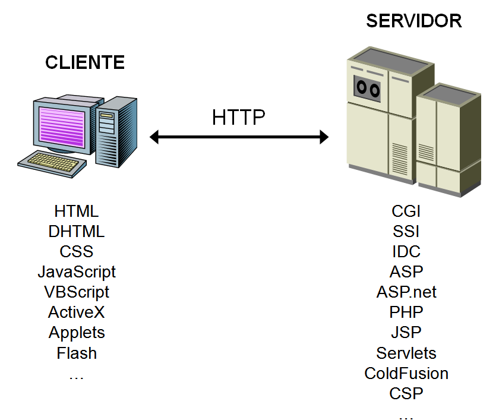

---
title:
    Apuntes
date: 16/06/2021
export_on_save:
    puppeteer: true
    html: true
puppeteer:
    scale: 1
    landscape: false
    format: "A4"
    printBackground: true
    margin:
        top: "1cm"
        right: "1cm"
        bottom: "2.5cm"
        left: "1cm"
    displayHeaderFooter: true
    headerTemplate: "&nbsp;"
    footerTemplate: "
        <span style=\"font-size: 9pt; display: flex;\">
            <span class=\"pageNumber\" style=\"margin-left: 1cm;\"></span>
            /
            <span class=\"totalPages\"></span>
            <span class=\"title\" style=\"margin-left: 1cm;\"></span>
            <span style=\"margin-left: 1cm;\">Xusa García y Juanjo Guarinos</span>
        </span>
                    "
toc:
    depth_from: 1
    depth_to: 5
    ordered: false
---

ÍNDICE

1. Introducción
2. Primeros SCRIPTS
3. Procedimientos y estructuras de control

## Introducción

Analizando el mercado actual de Bases de Datos, el uso de los diferentes productos existentes se ha segmentado.

|Usuarios BD|Bases de datos|
|:------------|:-----------|
|**Grandes Empresas** |La mayoría han apostado por Oracle por su seguridad y soporte.|
|**Pequeñas y medianas Empresas (PYMES)**|Aquí es donde más abierto está el mercado. Entre las más utilizadas están: Oracle Express, SQL Server de Microsoft, MySQL Server y PostgreSQL|
|**Pequeños negocios**|Utilizan software propietario que utiliza SGBD con prestaciones de tipo ofimático como Microsoft Access.|
|**Aplicaciones y páginas web**|La mayoría de los proveedores de internet tienen incluido en sus ofertas MySQL y PostgreSQL, pero los usuarios suelen usar MySQL.|

Aunque los aspectos fundamentales a la forma de utilizar un SGBD son muy parecidos, en este curso nos hemos centrado en **MySQL**.

MySQL es un sistema de gestión de bases de datos SQL (SGBD DBMS) multihilo y multiusuario que tiene más de 10 millones de instalaciones según MySQL AB de Oracle (<https://es.wikipedia.org/wiki/MySQL_AB>).

Las librerías para acceder a bases de datos MySQL están disponibles en los principales lenguajes de programación con APIs específicas de lenguaje. Además,una interfaz ODBC llamada MyODBC permite utilizar lenguajes de programación adicionales que soportan la interfaz ODBC para comunicarse con una base de datos MySQL. El servidor MySQL y las bibliotecas oficiales se implementan principalmente en ANSI C.

MySQL es popular para aplicaciones web y actúa como el componente de base de datos de las plataformas LAMP, MAMP y WAMP (Linux/Mac/Windows-Apache-MySQL-PHP/Perl). Su popularidad como aplicación web está estrechamente ligada a la popularidad de PHP, que a menudo se combina con MySQL. PHP y MySQL son componentes esenciales para ejecutar la popular plataforma de Gestor de Cotnenidos WordPress.

**Cliente / Servidor**
La arquitectura **cliente-servidor** es un modelo de diseño de software en el que las tareas se reparten entre los proveedores de recursos o servicios, llamados servidores, y los demandantes, llamados clientes.

Un cliente realiza peticiones a otro programa, el servidor, quien le da respuesta. Esta idea también se puede aplicar a programas que se ejecutan sobre una sola computadora, aunque es más ventajosa en un sistema operativo multiusuario distribuido a través de una red de computadoras.

Cuando utilizamos un navegado en Internet y accedemos a un servidor mediante una dirección web, utilizamos el protocolo **HTTP** o **HTTPS** para enviar información del cliente al servidor y viceversa.

Tanto cliente como servidor ejecutan código y por lo tanto, procesan las instrucciones de programas y aplicaciones, y para ello se utilizan diferentes lenguajes de programación. A continuación se muestran algunos ejemplos:


Puedes consultar el **Tiobe Index** de los lenguajes de programación más usados en: <https://www.tiobe.com/tiobe-index/>

Puedes consultar la web del **Instituto de Ingeniería Eléctrica y Electrónica** (Institute of Electrical and Electronics Engineers o IEEE), que con más de 425.000 miembros y voluntarios en 160 países, también publica su propia lista de lenguajes de programación más populares (se puede filtrar por Web):
<https://spectrum.ieee.org/static/interactive-the-top-programming-languages-2018>

**Programación en BD**
Los SGBD relacionales usan SQL como lenguaje de DCL, DDL y DML.

* **DCL – Data Control Language** – Lenguaje de Control de Datos
<https://es.wikipedia.org/wiki/Lenguaje_de_control_de_datos>
* **DDL – Data Definition Language** – Lenguaje de Definición de Datos
<https://es.wikipedia.org/wiki/Lenguaje_de_definici%C3%B3n_de_datos>
* **DML – Data Manipulation Language** – Lenguaje de Manipulación de Datos
<https://es.wikipedia.org/wiki/Lenguaje_de_manipulaci%C3%B3n_de_datos>

En las unidades anteriores hemos trabajado tanto el  DDL como el DML.

Las bases de datos relacionales poseen unas extensiones del lenguaje de consultas SQL que les permiten crear bloques de código que se ejecutan como un todo. Hay dos tipos de bloques de código:

* **Scripts**: conjunto de instrucciones que se guardan en un fichero con extensión .sql y que no forman parte de la base de datos. Los scripts se utilizan principalmente para tareas de administración de la base de datos.
* **Procedimientos y funciones almacenadas**: bloques de código que forman parte de una base de datos concreta, como las tablas. Los procedimientos y funciones son compilados después de crealos y pasan a formar parte de la base de datos como otro objeto más. Hay unos procedimientos especiales llamados **triggers** que se ejecutan cuando sucede algún evento sobre las tablas de la base de datos.

Todas las bases de datos relacionales permiten alamacenar código aunque la extemsión del lenguaje tiene una denominación diferente dependiendo del SGBD; en **Oracle se llama PL/SQL**, en **SQL Server Transact-SQL** y en **MySQL Stored Procedure Programming**.

En este tema nos centraremos en MySQL para trabajar con programación a través de **procedimientos**, **funciones** y **tratamiento de eventos**.

!!! Note Referencias
    [MySQL Oficial – Almacenamiento de Programas en MySQL](https://dev.mysql.com/doc/refman/8.0/en/stored-programs-views.html)

Los procedimientos almacenados y funciones son nuevas funcionalidades incluidas desde la versión de MySQL 5.0.
Algunas situaciones en que los procedimientos almacenados pueden ser particularmente útiles:

* Cuando múltiples aplicaciones cliente se escriben en **distintos lenguajes** o funcionan en distintas plataformas, pero necesitan **realizar la misma operación en la base de datos**.
* **Cuando la seguridad es muy importante**. Los bancos, por ejemplo, usan procedimientos almacenados para todas las operaciones comunes. Esto proporciona un entorno seguro y consistente, y los procedimientos pueden asegurar que cada operación se loguea apropiadamente. En tal entorno, las aplicaciones y los usuarios no obtendrían ningún acceso directo a las tablas de la base de datos, sólo pueden ejecutar algunos procedimientos almacenados.

Los procedimientos almacenados pueden mejorar el rendimiento ya que se necesita enviar menos información entre el servidor y el cliente. El inconveniente es que aumenta la carga del servidor de la base de datos ya que la mayoría del trabajo se realiza en la parte del servidor y no en el cliente. Considere esto, si muchas máquinas cliente (como servidores Web) se sirven a sólo uno o pocos servidores de bases de datos.

Los procedimientos almacenados le permiten tener bibliotecas o funciones en el servidor de base de datos. Esta característica es compartida por los lenguajes de programación modernos que permiten este diseño interno, por ejemplo, usando clases. Usando estas características del lenguaje de programación cliente es beneficioso para el programador incluso fuera del entorno de la base de datos.

## Primeros SCRIPTS

### SCRIPTS en MySQL

Comenzaremos por crear nuestro primer script en MySQL con sentencias de **Stored Procedures**.

Utilizaremos **`SELECT`** para mostrar resultados y **`SET`** para guardar valores en variables.

Los scripts de MySQL se puede ejecutar directamente con el programa  **`mysql.exe`**.

<div class="caso_estudio">

**`mysql.exe`** es una shell que conecta con el servidor de MySQL y permite ejecutar instrucciones de SQL. Cuando nos conectamos tenemos que indicar y contraseña si procede.
</div> <!-- fin caso de estudio -->

Para conectarnos como root hacemos:
**`C:\Program Files\MySQL\MySQL Server 8.0\bin> mysql -u root -p`**

!!! Example Ejemplo 1
    **Scripts**
    Crear un script de nombre **`b06ejer01.sql`** en una carpeta de nuestro gusto,por ejemplo **C:\GBD-UD06**. El script calcula la superficie de una pared a partir del ancho y alto de la misma. El ancho y alto se cargan previamente en dos variables.

    El script lo creamos con un editor de texto y su contenido es el siguiente:
    ```sql
    -- En x tenemos el ancho de la pared
    SET @x = 9;
    -- En y tenemos la altura
    SET @y = 15;
    -- La instrucción select calcula y muestra la superficie de la pared conjuntamente con el ancho y la altura.
    SELECT @x AS ancho, @y AS alto, @x * @y AS superficie;
    ```

    El script se puede ejecutar directamente con el programa  **`mysql.exe`**. Una vez que hayamos conectados utilizamos el comando **`source`** para ejecutar el script.

    ```txt
    mysql> source C:/GBD-UD6/b06ejer01.sql;
    Query OK, 0 rows affected (0.00 sec)
    Query OK, 0 rows affected (0.00 sec)
    +-------+------+------------+
    | ancho | alto | superficie |
    +-------+------+------------+
    | 9     | 15   | 135        |
    +-------+------+------------+
    1 row in set (0.00 sec)
    ```

Los nombres de las variables en los scripts tienen que comenzar con el símbolo **@**.
Las instrucciones **SET** y **SELECT** pueden ejecutarse también directamente desde el intérprete de comandos.

### Comentarios

Los comentarios dentro de los SCRIPTS pueden hacerse de la siguiente manera:

```sql
# comentario con almohadilla (solo una linea)
-- Comentario con dos guiones (solo una linea)
/* comentario con barra asterisco (solo una linea) */
/*
  esto es
  un comentario
  multilinea
*/
```

### Variables definidas por el usuario

Para definir una variable de usuario utilizaremos el carácter **@**. Asignaremos valores con el comando **`SET`**:

```sql
SET @num = 9, @cad = 'Hola';
SET @num := 9, @cad := 'Hola';
```

Y para mostrar sus valores la instrucción **`SELECT`**:

```sql
SELECT @num, @cad;
```

Las variables puede usarse en instrucciones **`SELECT`** de recuperación de datos, como:

```sql
SELECT * FROM ciudades WHERE codigo > @num;
```

También podemos calcular y asignar valor en la misma instrucción, almacenando resultados de nuestras **`SELECT`**, pero en este caso sólo funciona el operador **`:=`**. Si no deseamos que se produzca la salida del resultado, sino sólo almacenarlo, podemos usar la cláusula **`INTO`**:

!!! Example Ejemplo 2
    **Scripts**
    Crear un script que asigne a la variable **numreg** la cantidad de ciudades que hay en la tabla **ciudades**.
    ```sql
    -- Asigna el número de ciudades a la variable numreg y muestra el resultado por pantalla.
    SELECT @numreg := COUNT(*) FROM ciudades;

    -- Asigna el número de ciudades a la variable numreg pero NO  muestra el resultado por pantalla.
    SELECT COUNT(*) INTO @numreg FROM ciudades;
    ```

Para consultar todas las variables creadas por el usuario, podemos consultar la tabla **performance_schema.user_variables_by_thread** a partir de la versión 5.7 de MySQL:

```sql
SELECT * FROM performance_schema.user_variables_by_thread;
```

### Variables del sistema

MySQL tiene muchas variables de sistema que pueden consultarse en <https://dev.mysql.com/doc/refman/8.0/en/server-system-variable-reference.html> y que podemos consultar con la instrucción **`SHOW VARIABLES LIKE`**.

```sql
SHOW VARIABLES LIKE '%';
```

Las variables de sistema pueden ser de tipo:

* **GLOBAL**: su valor es para todos los usuarios conectados
* **SESSION**: su valor puede ser diferente para cada usuario

Para mostrar el valor de alguna variable global utilizaremos una doble **@** tal como se muestra en este ejemplo con la variable *max_connections*.

```sql
SELECT @@max_connections;
```

Para asignar un nuevo valor a la variable **GLOBAL** utilizaremos una de las dos opciones siguientes:

```sql
SET GLOBAL max_connections = 50;
SET @@global.max_connections = 50;
```

Por ejemplo la variable *lc_messages* define el idioma en que se muestran los mensajes de error. Podríamos tener el valor *en_US* para tenerlos en inglés o *es_ES* para español.

Para asignar un nuevo valor a la variable de sistema de tipo **SESSION** utilizaremos una de las siguientes cuatro opciones mostradas en el ejemplo con la variable *lc_messages*.

```sql
SET lc_messages = 'es_ES';
SET @@lc_messages='es_ES';
SET SESSION lc_messages = 'es_ES';
SET @@local.lc_messages='es_ES';
```
    
Prueba a ejecutar las siguientes instrucciones después de conectar con **`mysql.exe`** y comprueba el resultado:

```sql
mysql> SET SESSION lc_messages='en_US';
mysql> MENSAJES;
ERROR 1064 (42000): You have an error in your SQL syntax; check
the manual that corresponds to your MySQL server version for the
right syntax to use near 'MENSAJES' at line 1
mysql> SET SESSION lc_messages='es_ES';
mysql> MENSAJES;
ERROR 1064 (42000): Algo está equivocado en su sintax cerca
'MENSAJES' en la linea 1
```

!!! Example Ejemplo 3
    **Scripts**
    Crea un **script** que conecte con la base de datos **world** y guarde en una variable el número de registros de la tabla **city** y en otra el número de registros de la tabla **country**. Ejecutar un **`SELECT`** que muestre la cantidad de registros de las dos tablas.

    El script **`b06ejer02.sql`** tendrá las siguiente instrucciones:
    ```sql
    USE world;
    SELECT @numCity := count(*) FROM city;
    SELECT @numCountry := count(*) FROM country;
    SELECT @numCity AS NREG_City, @numCountry AS NREG_Country;
    ```
    Para ejecutar el script realizamos los siguientes comandos:
    ```cmd 
    C:\> cd "\Program Files\MySQL\MySQL Server 8.0\bin\mysql"
    C:\Program Files\MySQL\MySQL Server 8.0\bin\mysql> mysql -u root -p
    mysql> source C:/GBD-UD6/b06ejer02.sql;
    ```
    
#### Ejecutar scripts

La mayoría de scripts los generamos en UTF8 por lo que deberemos cambiar el conjunto de caracteres de la ventana de comandos del CMD.

```cmd
// Cambiar a juego de caracteres en UTF8
C:\> chcp 65001
// Cambiar a juego de caracteres en ANSI West European Latin
C:\> chcp 1252
```

Para cambiar en timepo real el juego de caracteres en el resultado de los **`SELECT`** en MySQL, podemos utilizar el comando ****`SET NAMES`****.

```sql
// Cambiar a juego de caracteres en UTF8
mysql> SET NAMES 'utf8';
// Cambiar a juego de caracteres en ANSI West European Latin
mysql> SET NAMES 'latin1';
```

El comando **`mysql`** dispone además de muchos parámetros. Usaremos algunos:

|Parámetro|Descripción|
|:-|:-|
|**--silent**| En el modo silencioso no muestra tantos mensajes|
|**--table**| La salida de los SELECT la muestra en formato tabla|
|**--html**| La salida de los SELECT la muestra en formato HTML|

Ejemplo de forma de conexión.

```cmd
//Conectarse como root en modo silencioso
C:\> mysql -u root -p --silent --table
```

## Procedimientos y estructuras de control

### Sintaxis y Estructura

Para poder almacenar un conjunto de instrucciones en la propia base de datos podemos utilizar los procedimientos.

La sintaxis más sencilla es la siguiente:

```sql
DELIMITER //
CREATE PROCEDURE nombre()
BEGIN
    instrucciones;
END //
DELIMITER ;
```

Antes de comenzar debemos seleccionar la base de datos con la que vamos a trabajar. Por ejemplo para trabajar con la base de datos world ejecutaríamos:

```sql
USE world;
```

Si por ejemplo deseamos un procedimiento que muestre el día y hora sería:

!!! Example Ejemplo 1
    **Procedimientos**
    Realizar un procedimiento que calcule el día y la hora actual y la muestre por pantalla.
    ```sql
    DELIMITER //
    CREATE PROCEDURE diayhora()
    BEGIN
        SELECT NOW();
    END //
    DELIMITER ;
    ```

Para llamar al procedimiento se utiliza el comando **`CALL`**.

!!! Example Ejemplo 2
    **Procedimientos**
    Ejecutar el procedimiento **diayhora** creado en el ejemplo anterior.
    ```sql
    CALL diayhora();
    ```

Los procedimientos se asignan a una base de datos. Esto quiere decir que debemos indicar el **SCHEMA** o BASE DE DATOS al crear o eliminar el procedimiento. Podemos usar previamente la selección de base de datos por defecto con el comando **`USE`** como en el ejemplo anterior o bien indicarla al crear el procedimiento como se hace en los **`SELECT`** de las tablas. Por ejemplo para crear el procedimiento en la base de datos world, independientemente de cual tengamos seleccionada, la cabecera del procedimiento sería: **`CREATE PROCEDURE world.diayhora()`**.

#### DELIMITER

En la declaración del procedimiento hemos usado delimiter pero, ¿por qué es importante el uso del **`DELIMITER`**?.

Ya sabemos que por defecto MySQL usa como delimitador de fin de instrucción el punto y coma (\;) , es decir, cada vez que encuentre punto y como(\;) ejecuta hasta ahí. Como en los procedimientos hay varias líneas de códigos y algunas de ellas terminan con este delimitador se ejecutaría solo hasta ahí, lo que ocasionaría un error, y es por esto que es necesario indicarle a MySQL que utilice otro dlimitador que puede ser cualquiera. Ese es el próposito de la cláusula **`DELIMITER`**.

Para nuestro ejemplo usamos **//** pero se podría usar también **$$** o lo que queramos. Al finalizar la creación del procedimiento o función volvemos a cambiarlo por **;**

```sql
DELIMITER $$
    ...
    $$
DELIMITER ;
```

#### Bloques de código

Para poder agrupar varias instrucciones en bloques utilizaremos: **`BEGIN ... END`**.
En los procedimientos es necesario porque define el espacio de instrucciones que se almacenan.

Estos bloques de código se usarán más adelante también en estructuras de control como: **`IF .. THEN .. END IF`**

#### Redefinir y Eliminar

Para eliminar un procedimiento utilizaremos la instrucción **`DROP PROCEDURE`**.

```sql
DROP PROCEDURE nombreProcedimiento;
```

Si queremos redefinir un procedimiento, para evitar que si no existe muestre un error lo haremos utilizando la cláusula **`IF EXISTS`**.

```sql
DROP PROCEDURE IF EXISTS nombreProcedimiento;
```

### Variables locales del procedimiento

Cuando necesitamos variables que usaremos dentro del procedimiento debemos usar la instrucción **`DECLARE`** como si lo hiciéramos en la instrucción **`CREATE TABLE`**. Las variables sólo serán visibles y accesibles dentro del procedimiento.
Estas variables no comienzan con el caracter especial @, al contrario de lo que sucede en los scripts.

```sql
DECLARE nombreVariable tipoVariable [opciones];
```

#### Estructuras de control

Las instrucciones de un procedimiento (o función) se ejecutan secuencialmente empezando por la instrucción que está justo después de la palabra reservada **`BEGIN`** y acabando por la que está justo antes de la palabra reservada **`END`**. Esta forma de ejcución de instrucciones se llama **secuencial**. El siguiente diagrama representa un bloque de 3 instrucciones que se ejecutan secuencialmente. El punto negro inicial representa el **`BEGIN`** y el punto con el aspa el **`END`**.


Las estructuras de control permiten modificar el flujo de ejecución de las instrucciones de un programa.

No obstante, hay algunas directiva que nos permiten cambiar el orden secuencial de ejecución de instrucciones. A estas directivas comunmente se les llama estructuras de control. Las estructuras de control se pueden englobar en dos categorías:

* **Estructuras de control condicionales**: en función de una condición se ejecutan un bloque de instrucciones u otro (o ninguno).
* **Estructuras de control de repetición**: permiten que un bloque de instrucciones se ejecuta un cierto o número de veces o mientras se cumpla una condición.

#### Estructuras de control condicionales

**Sentencia IF**
Es la más sencilla de todas. Nos permite ejecutar unas instrucciones u otras según una condición. Hay 3 variantes:

***Variante 1***
Esquema general

```sql
IF [condicion] THEN
    [sentencia o bloque de sentencias]
END IF;
```


El rombo equivaldría al **`END IF`**.

***Variante 2***
Esquema general

```sql
IF [condicion] THEN
    [sentencia o bloque de sentencias]
ELSE
    [sentencia o bloque de sentencias]
END IF;
```


***Variante 3***
Esquema general

```sql
IF [condicion] THEN
    [sentencia o bloque de sentencias]
ELSEIF [condicion] THEN
    [sentencia o bloque de sentencias]
ELSE
    [sentencia o bloque de sentencias]
END IF;
```


    
Puede haber tantas cláusulas **`ELSEIF`** como queramos pero sólo puede haber una cláusula **`IF`** y una **`ELSE`**.

!!! Example Ejemplo 3
    **Procedimientos**
    En el siguiente ejemplo creamos un procedimiento para mostrar un **color** de forma aleatoria según el valor obtenido con la función **`RAND()`** la cual devuelve un número real entre 0 y 1, es decir, obtenemos un número n que cumple 0 ≤ n < 1.
    ```sql
    -- Eliminar el procedimiento si ya existe
    DROP PROCEDURE IF EXISTS colores;

    -- Crear el procedimiento
    DELIMITER //
    CREATE PROCEDURE colores()
    BEGIN
        DECLARE num DECIMAL(15,2);
        SET num := RAND();
        IF (num < 0.25) THEN
            SELECT 'verde' AS COLOR;
        ELSEIF (num < 0.50) THEN
            SELECT 'amarillo' AS COLOR;
        ELSEIF (num < 0.75) THEN
            SELECT 'naranja' AS COLOR;
        ELSE
            SELECT 'rojo' AS COLOR;
        END IF;
    END //
    
    DELIMITER ;
    -- Llamar al procedimiento
    CALL colores();
    ```     ELSEIF (num < 0.50) THEN
      SELECT 'amarillo' AS COLOR;
     ELSEIF (num < 0.75) THEN
      SELECT 'naranja' AS COLOR;
     ELSE
      SELECT 'rojo' AS COLOR;
     END IF;

<span style="color: red; font-weight: bold;">AQUÍ ME HE QUEDADO
</span>

***Sentencia CASE***
Cuando tenemos varias opciones como en el ejemplo anterior, podemos utilizar también la estructura **CASE**.

```sql
CASE [variable o expresión]
 WHEN [valor] THEN
  [sentencia o bloque de sentencias]
 [WHEN [valor] THEN
  [sentencia o bloque de sentencias] ]
 [ELSE
  [sentencia o bloque de sentencias] ]
END CASE;
```

O bien

```txt
CASE
 WHEN [condicion] THEN
  [sentencia o bloque de sentencias]
 [WHEN [condicion] THEN
  [sentencia o bloque de sentencias] ]
 [...]
 [ELSE
  [sentencia o bloque de sentencias] ]
END CASE;
```

Si realizamos el mismo ejemplo con CASE quedaría:

Ejemplo 2 – SCRIPT con CASE

```sql
/* Eliminar el procedimiento si ya existe */
DROP PROCEDURE IF EXISTS ud6ejer.colorescase;
/* Crear el procedimiento */

DELIMITER //
CREATE PROCEDURE ud6ejer.colorescase()
BEGIN
 DECLARE num DECIMAL(15,2);
 SET num := RAND();
 CASE
  WHEN (num < 0.25) THEN
   SELECT 'verde' AS COLOR;
  WHEN (num < 0.50) THEN
   SELECT 'amarillo' AS COLOR;
  WHEN (num < 0.75) THEN
   SELECT 'naranja' AS COLOR;
  ELSE
   SELECT 'rojo' AS COLOR;
 END CASE;
END //
DELIMITER ;

/* Llamar al procedimiento */
CALL ud6ejer.colorescase();
```

***Sentencia WHILE***
Otra estructura de control es la de bucles, que consisten en realizar de forma repetida un conjunto de instrucciones. Tenemos varias estructuras para hacer bucles como **REPEAT** o **LOOP**, pero nosotros usaremos **WHILE**.

```sql
WHILE [condicion] DO
 [sentencia o bloque de sentencias]
END WHILE;
```

En los bucles debemos que queremos repetir N veces, debemos crear una variable contador e incrementarla cada vez que se ejecuta. Por ejemplo un blucle para ejecutar 10 veces unas instrucciones:

```sql
DECLARE contador INT;
SET contador := 1;
WHILE (contador <= 10) DO

 [sentencia o bloque de sentencias]

SET contador := contador + 1;
END WHILE;
```

En el siguiente ejemplo mostramos la suma de los 10 primeros números enteros.

Ejemplo 3 – SCRIPT con WHILE

```sql
/* Eliminar el procedimiento si ya existe */
DROP PROCEDURE IF EXISTS ud6ejer.sumadieznumeros;

/* Crear el procedimiento */
DELIMITER //
CREATE PROCEDURE ud6ejer.sumadieznumeros()
BEGIN
 DECLARE contador INT;
 DECLARE resultado INT;
 SET resultado := 0;
 SET contador := 1;
 WHILE (contador<=10) DO
  SET resultado := resultado + contador;
  SET contador := contador + 1;
 END WHILE;
 SELECT resultado AS 'SUMADIEZNUMEROS';
END //
DELIMITER ;

/* Llamar al procedimiento */
CALL ud6ejer.sumadieznumeros();
```

### Parámetros

En muchas ocasiones los procedimientos necesitan recibir valores como parámetros. En MySQL podemos definir estas variables y usarlas dentro del procedimiento. En ejemplo siguiente, si queremos comparar dos cadenas y saber cuál tiene más caracteres, deberemos indicarle al procedimiento qué cadenas comparar.

Ejemplo 4 – SCRIPT con parámetros

```sql
/* Eliminar el procedimiento si ya existe */
DROP PROCEDURE IF EXISTS ud6ejer.comparacadenas;

/* Crear el procedimiento */
DELIMITER //
CREATE PROCEDURE ud6ejer.comparacadenas(cad1 VARCHAR(500), cad2 VARCHAR(500))
BEGIN
 CASE
  WHEN (LENGTH(cad1)>LENGTH(cad2)) THEN
   SELECT 'La PRIMERA cadena es más larga' AS RESULTADO;
  WHEN (LENGTH(cad1)<LENGTH(cad2)) THEN
   SELECT 'La SEGUNDA cadena es más larga' AS RESULTADO;
  ELSE
   SELECT 'La dos cadenas miden lo mismo' AS RESULTADO;
 END CASE;
END //
DELIMITER ;

/* Llamar al procedimiento */
CALL ud6ejer.comparacadenas('Mi primera cadena','Esta debe ser más larga');
```

## Funciones predefinidas 4. Funciones predefinidas

 Una función es un conjunto de líneas de código que realizan una tarea específica, al  igual  que un procedimiento, pero además puede retornar un valor.
En MySQL existen multitud de funciones predefinidas. Se pueden consultar en la documentación oficial y en otras reconocidas:

!!! Note Referencias

    * [MySQL Oficial – Funciones en MySQL – Web W3SCHOOLS Interactiva](https://www.w3schools.com/sql/sql_ref_mysql.asp)
    * [MySQL Oficial – Funciones en MySQL – Web Oficial en inglés](https://dev.mysql.com/doc/refman/5.7/en/functions.html)
    * [MySQL Oficial – Funciones en MySQL – Web en español](http://ftp.tcrc.edu.tw/MySQL/doc/refman/5.0/es/functions.html)
    * [MySQL Oficial – Funciones en MySQL – Ejemplos]( http://mysql.conclase.net/curso/?cap=011)

Las funciones pueden tomar parámetros que modifiquen su funcionamiento.
Los procedimiento y las funciones son utilizadas para descomponer grandes problemas en tareas simples y para implementar operaciones que son comúnmente utilizadas durante un programa y de esta manera reducir la cantidad de código.

Cuando una función es invocada/llamada, se le pasa el control a la misma, y una vez  que esta finaliza devuelve el control al punto desde el cual fue llamada.

### Funciones matemáticas

Las que más vamos a usar son: **ABS, FLOOR, MOD, POW, SQRT, RAND, ROUND, SIGN**

***Ejemplos de funciones predefinidas***

**Ejemplo 1** - Valor absoluto de un número entero

```sql
 SELECT ABS(-17);
```

Resultado: 17

```sql
# Resultado: 21
SELECT ABS(21);
```

**Ejemplo 2 -  Parte entera de un número decimal**

```sql
SELECT FLOOR(35.789);
```

Resultado: 35

```sql
SELECT FLOOR(-35.789);
```

Resultado: -36

**Ejemplo 3 -  Resto de una división entre dos número enteros**

```sql
SELECT MOD(15, 4);
```

Resultado: 3

**Ejemplo 4 - Potencia de un número y su exponente**

```sql
 SELECT POW(5, 2);
```

 Resultado: 25

**Ejemplo 5 - Raíz cuadrada de un número**

```sql
 SELECT SQRT(64);
```

Resultado: 8

**Ejemplo 6 - Número aleatorio decimal entre 0 y 1**

 ```sql
SELECT RAND();
 ```

Resultado: 0.601966295951946

**Ejemplo 7 - Redondea un número decimal hasta los decimales que se indiquen**

```sql
SELECT ROUND(45.267, 1);
```

Resultado: 45.3

```sql
SELECT ROUND(-45.267, 2);
```

Resultado: -45.27

```sql
SELECT ROUND(45.267);
```

Resultado: 45

```sql
SELECT ROUND(45.75);
```

Resultado: 46

```sql
SELECT ROUND(-45.267);
```

Resultado: -45

```sql
SELECT ROUND(-45.67);
```

Resultado: -46

**Ejemplo 8 - Obtiene el signo del número**

```sql
SELECT SIGN(-45.6);
```

Resultado: -1

```sql
SELECT SIGN(45.6);
```

Resultado: 1

```sql
SELECT SIGN(0);
```

Resultado: 0

## Funciones de cadenas o strings

Las que más vamos a usar son: **CONCAT, UPPER, LOWER, LEFT, RIGHT, SUBSTRING, SUBSTRING_INDEX,INSTR, LENGTH, TRIM, REPEAT, REPLACE, REVERSE, STRCMP**

Ejemplo 1 - Concatenar varias cadenas

```sql
SELECT CONCAT('Juan ','López ','García') AS NOMBRE;
```

 +-------------------+
 | NOMBRE            |
 +-------------------+
 | Juan López García |
 +-------------------+

Ejemplo 2 - Pasar a mayúsculas

```sql
SELECT UPPER('Soy alumno de FP') AS MENSAJE;
```sql

 +------------------+
 | MENSAJE          |
 +------------------+
 | SOY ALUMNO DE FP |
 +------------------+
 
 Ejemplo 2 - Pasar a minúsculas
```sql
 SELECT LOWER('Soy alumno de FP') AS MENSAJE;
```

 +------------------+
 | MENSAJE          |
 +------------------+
 | soy alumno de fp |
 +------------------+

```sql
Ejemplo 3 - Obtener una parte inicial de la cadena 
SELECT LEFT('Juan López García',4) AS NOMBRE;
```

+--------+
| NOMBRE |
+--------+
| Juan   |
+--------+
/*Obtener una parte final de la cadena */
SELECT RIGHT('Juan López García',6) AS APELLIDO2;
+-----------+
| APELLIDO2 |
+-----------+
| García    |
+-----------+
/* Obtener una parte central de la cadena */
SELECT SUBSTRING('Juan López García',6,5) AS APELLIDO1;
+-----------+
| APELLIDO1 |
+-----------+
| López     |
+-----------+
/* Obtener parte de una cadena utilizando la posición de un delimitador*/
SELECT SUBSTRING_INDEX('www.iesdoctorbalmis.com','.',2) AS DOMINIO;
+---------------------+
| DOMINIO             |
+---------------------+
| <www.iesdoctorbalmis> |
+---------------------+

<div class="caso_estudio">

:bulb: **Caso de estudio:**

```sql
SELECT SUBSTRING_INDEX('www.iesdoctorbalmis.com','.',2) AS DOMINIO;
```

```txt
+---------------------+
| DOMINIO             |
+---------------------+
| www.iesdoctorbalmis |
+---------------------+
```

</div> <!-- fin caso de estudio -->

<div class="ejercicio">

### :white_check_mark: Ejercicio

</div> <!-- fin ejercicio -->
