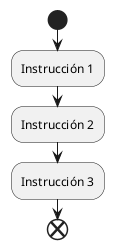
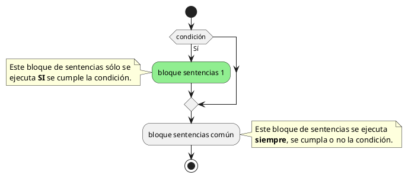
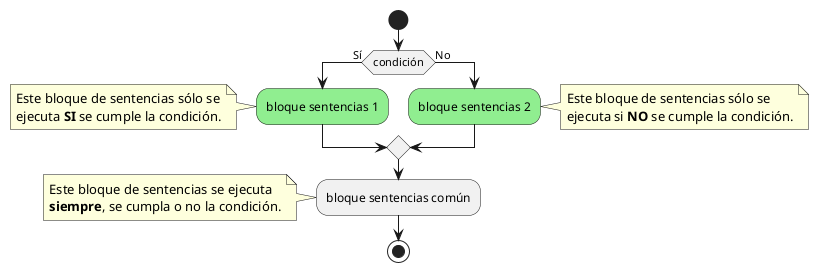
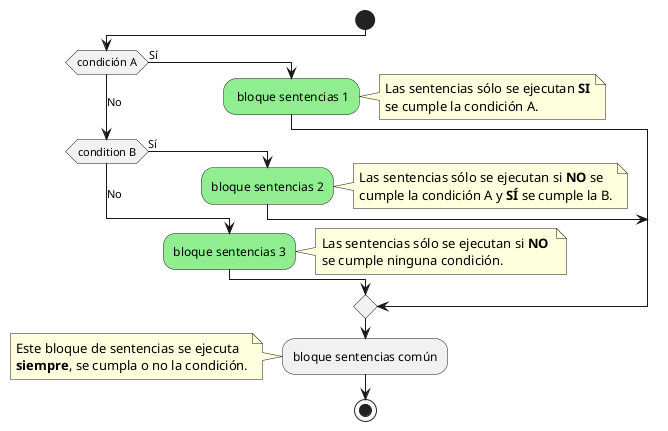

---
title:
    Apuntes
date: 16/06/2021
export_on_save:
    puppeteer: true
    html: true
puppeteer:
    scale: 1
    landscape: false
    format: "A4"
    printBackground: true
    margin:
        top: "1cm"
        right: "1cm"
        bottom: "2.5cm"
        left: "1cm"
    displayHeaderFooter: true
    headerTemplate: "&nbsp;"
    footerTemplate: "
        
            
            /
            
            
            Xusa García y Juanjo Guarinos
        
                    "
toc:
    depth_from: 1
    depth_to: 5
    ordered: false
---

## Título 1

Aquí viene texto y a continuación el diagrama de actividad 1.

Aquí viene más texto y a continuación el diagrama de actividad 2.

Aquí viene más texto y a continuación el diagrama de actividad 3.

Aquí viene más texto y a continuación el diagrama de actividad 4.

